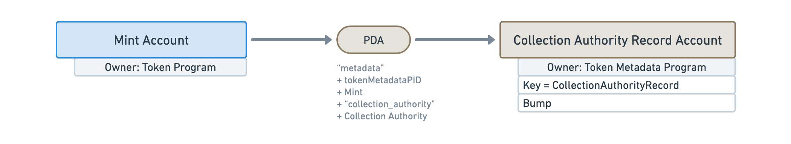
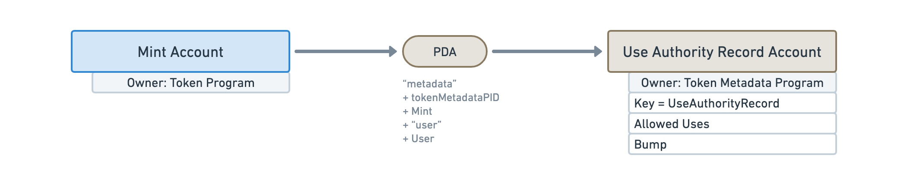

import ProgramAccount from '../../../src/program-account.jsx';
import idl from './idl.js';

# Accounts

## Metadata

<ProgramAccount idl={idl} account="Metadata">

The Metadata Account is responsible **for storing additional data attached to tokens**. As every account in the Token Metadata program, it derives from the Mint Account of the token using a PDA.

It stores a variety of information for different use-cases and, thus, the reader might benefit from reading the "fields" table below to learn more about them. Additionally, dedicated feature pages have been written to provide more documentation on what can be done with these fields. Their description will contain a link to the appropriate page when available.

One particular field to notice is the `Uri` field that points to an off-chain JSON file which, itself, contains more data. [That data is standardized](./token-standard) so applications and marketplaces can reliably find information on a given token. If you're wondering why the Metadata account provides two data stores — one off-chain and one on-chain — you might want to [take a look at the FAQ here](./faq#why-does-the-metadata-account-have-both-on-chain-and-off-chain-data).

</ProgramAccount>

## Master Edition

<ProgramAccount idl={idl} account="MasterEditionV2">

The Master Edition account, derived from a Mint Account, is an important component of NFTs because **its existence is proof of the Non-Fungibility of the token**.

When creating a Master Edition account, the Token Metadata program will check for the following conditions:

- The Mint Account has **zero decimals**, i.e. `Decimals = 0`.
- The Mint Account minted **exactly one token** to a wallet, i.e. `Supply = 1`.

Additionally, it will transfer the `Mint Authority` and the `Freeze Authority` to the Master Edition account to prevent anyone from being able to mint additional tokens. You can read more about [why these authorities are transferred instead of being voided in the FAQ](./faq#why-are-the-mint-and-freeze-authorities-transferred-to-the-edition-pda).

Therefore, what we end up with is a Mint Account whose supply will never go above one and whose token cannot be shared or divided. As such, we end up with a Non-Fungible Token (NFT).

On top of being a Non-Fungible proof, **the Master Edition allows NFTs to be printed** a limited or unlimited amount of times. The Master Edition NFT acts as the "original record" of the digital asset that can be duplicated or "printed" into Edition NFTs. This allows creators to offer more than one copy of their digital assets to their audience.

The optional `Max Supply` field of the Master Edition account tells us how many copies of the NFT can be created. When set to `None`, an unlimited amount of copies can be created. When set to zero, the NFT cannot be copied.

</ProgramAccount>

## Edition

<ProgramAccount idl={idl} account="Edition">

The Edition account, derived from a Mint Account, **represents an NFT that was copied from a Master Edition NFT**.

It is important to note that the seeds used to generate this PDA account are the same as the Master Edition account. This means an NFT can either be a Master Edition NFT or an Edition NFT but not both.

Similarly to the Master Edition account, the Edition account will perform Non-Fungibility checks and gets assigned as the `Mint Authority` and the `Freeze Authority` of the Mint Account.

Additionally, the Edition account keeps track of the Master Edition account it was printed from in the `Parent` field as well as the edition number in the `Edition` field.

</ProgramAccount>

## Edition Marker

<ProgramAccount idl={idl} account="EditionMarker">

Edition Marker accounts are used internally by the program to **keep track of which editions were printed** for a given Master Edition.

Each Edition Marker account is responsible for storing a subset of the printed editions. More precisely, **they each store 248 editions using a bitmask** where `0` means, the edition has not been printed and `1` means it has. That means Master Edition accounts typically end up using more than one Edition Marker account.

To understand how this works, let's imagine that we want to print the 500th edition of a Master Edition.

To know if this edition has already been printed, we need to check the third Edition Marker account because the first two are keeping track of the first 496 editions (248 + 248 = 496) and should, at this point, be full of `1`s. Then, we can check the fourth bit of the third Edition Marker to see if the 500th edition has already been printed.

Therefore, we can find out if the `n`th edition was printed by checking the `n % 248`th bit of the `⌊n / 248⌋`th Edition Marker.

This is why `⌊n / 248⌋` is used as a seed of the Edition Marker PDA.

</ProgramAccount>

## Collection Authority Record

<ProgramAccount idl={idl} account="CollectionAuthorityRecord">

Collection Authority Record accounts are used internally by the program to **keep track of which authorities are allowed to set and/or verify the collection** of the token's Metadata account.

It uses a PDA derived from both the Mint Account and the public key of the authority. That way, one can check if a public key is allowed to alter the collection of an NFT by checking the existence of a Collection Authority Record account. The Collection Authority Record account stores the `Bump` that was used to generate the PDA to provide more thorough verification.

You can [read more about NFT Collections here](./certified-collections).

</ProgramAccount>

## Use Authority Record

<ProgramAccount idl={idl} account="UseAuthorityRecord">

Use Authority Record accounts are used internally by the program to **keep track of which authorities are allowed to reduce the uses** of the token's Metadata account.

It uses a PDA derived from both the Mint Account and the public key of the authority. That way, one can check if a public key is allowed to reduce the uses of an NFT by checking the existence of a Use Authority Record account. The Use Authority Record account stores the `Bump` that was used to generate the PDA to provide more thorough verification.

It also stores the `Allowed Uses` for the given authority to ensure it cannot use more than what it was allowed to use.

You can [read more about using NFTs here](./using-nfts).

</ProgramAccount>
