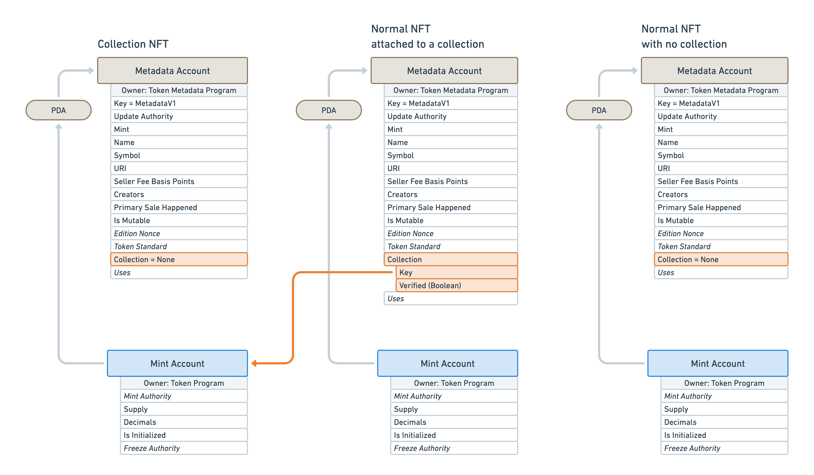

# Certified Collections

## Introduction

Certified Collections enables NFTs – and tokens in general — **to be grouped together** and for that information to be **verified on-chain**. Additionally, it makes it easier to manage these collections by allocating data for them on-chain.

This feature provides the following advantages:

- Easy to identify which collection any given NFT belongs to without making additional on-chain calls.
- Possible to find all NFTs that belong to a given collection ([Check the FAQ to see how](./faq#how-can-i-filter-metadata-accounts-by-collection-using-getprogramaccounts)).
- Easy to manage the collection metadata such as its name, description and image.

:::info

The on-chain Certified Collection feature has been added to the Token Metadata program in [version 1.1](./changelog/v1.1).

It replaces the `collection` field previously defined in external JSON metadata.

:::

## Collection NFTs

In order to group NFTs — or any token — together, we must first create a Collection NFT whose purpose is to store any metadata related to that collection. That's right, **a collection of NFT is itself, an NFT**. It has the same data layout on-chain as any other NFT.

The difference between a Collection NFT and a Regular NFT is that the information provided by the former will be used to define the group of NFTs it contains whereas the latter will be used to define the NFT itself.

Collection NFTs and Regular NFTs are **linked together using a "Belong To" relationship** on the Metadata account. The optional `Collection` field on the Metadata account has been created for that purpose.

- If the `Collection` field is set to `None`, it means the NFT is not part of a collection.
- If the `Collection` field is set, it means the NFT is part of the collection specified within that field.

As such, the `Collection` field contains two nested fields:

- `Key`: This field points to the Collection NFT the NFT belongs to. More precisely, it points to **the public key of the Mint Account** of the Collection NFT. This Mint Account must be owned by the SPL Token program.
- `Verified`: This boolean is very important as it is used to verify that the NFT is truly part of the collection it points to.

Notice that, because Collections and NFTs are linked together via a "Belong To" relationship, it is possible by design to define nested collections.

Also note that there is currently no way to distinguish between a Collection NFT and a Regular NFT that is part of a Collection. This is a limitation we are currently working on as part of [version 1.3](https://github.com/metaplex-foundation/metaplex-program-library/discussions/444).

## Verifying NFTs in Collections

As mentioned above, the `Collection` field contains a `Verified` boolean which is used to **determine if the NFT is truly part of the collection it points to**. Without this field, anyone could pretend their NFT to be part of any collection.

In order to flip that `Verified` boolean to `True`, the Authority of the Collection NFT must sign the NFT to prove that it is allowed to be part of the collection.

:::warning

**EXTREMELY IMPORTANT** 🚨

Explorers, Wallets and Marketplaces, **MUST CHECK** that `Verified` is true. `Verified` can only be set true if the Authority on the Collection NFT has run the `VerifyCollection` instruction over the NFT.

This is the same pattern as the `Creators` field where `Verified` must be true to validate the NFT.

In Order to check if a collection is valid on an NFT you **MUST**:

1. Check that the `Collection` struct is set.
2. Check that the `Key` in the `Collection` struct is owned on chain by the SPL Token program.
3. Check that `Verified` is true.

If those 3 steps are not followed you could be exposing fraudulent NFTs on real collections.

:::

The following instructions are available to set, verify or unverify an NFT as part of a collection:

- [Verify the collection](./instructions#verify-the-collection)
- [Unverify the collection](./instructions#unverify-the-collection)
- [Set and verify the collection](./instructions#set-and-verify-the-collection) (Introduced in version 1.2)

## Delegating the Collection Authority

By default, only **the Update Authority of the Collection NFT can verify** that an NFT is part of that collection.

However, the Update Authority can also **delegate this responsibility** to other authorities. This allows us to delegate the ability to add NFTs to our collection to one or several trusted parties. These delegated Collection Authorities can then set, verify and/or unverify NFTs from this collection using the instructions listed in the previous section.

The following instructions enable us to approve and reject a Collection Authority:

- [Approve a new Collection Authority](./instructions#approve-a-new-collection-authority)
- [Revoke an existing Collection Authority](./instructions#revoke-an-existing-collection-authority)

## Set and verify a collection using collections.metaplex.com

Metaplex provides a helpful [web tool](https://collections.metaplex.com/) that allows us to create Collection NFTs and add verified NFTs to them.

You may use the following step to get started with that tool:

1. Visit [collections.metaplex.com](https://collections.metaplex.com/)
2. Connect your wallet, but first, verify this wallet is the Update Authority.
3. Select the cluster you want to work on — e.g. devnet, mainnet, etc.
4. Click on "**Create a Collection**".
5. Enter the name, symbol, logo, and description of your Collection NFT.
6. Choose between these three options:
   1. **Individual NFTs**: Insert the mint address of your NFTs.
   2. **First verified creator**: Insert the public key of the first creator defined in your NFTs. This can help with Candy Machines as the first creator address is derived from their public key.
   3. **CSV file**: Upload a CSV file that contains the list of mint addresses. The CSV file should contain all the public keys, separated by commas with no spaces.
7. Click "**Create Collection**" and two transaction approvals will be required.
   1. The first transaction approval will allow Metaplex to be the delegate to make the migration.
   2. The second transaction will create the parent Collection NFT.
8. After the parent Collection NFT is created, **the migration will start** in the background. You may close the tab and come back to it later with the same wallet to see the status.

:::warning

For a smoother experience, please consider the following points when using this tool:

- Always check Solana's network before you start up a migration. You can check here https://solscan.io.
- If a "Retry" button appears it could be due to network congestion, so click retry and monitor the network.
- If a "Fail to Migrate Collection" appears, it is likely because a wrong Update Authority was provided.

For all other issues regarding this tool, please visit our discord for further support.

:::

Note that the Metaplex team has recorded a video tutorial on how Verified Collections work and how to use the web tool mentioned above. You can [watch it here](https://drive.google.com/file/d/1VU4xL_yF6LCe0UogVn4As5PMAzUV__8C/view?usp=sharing):

