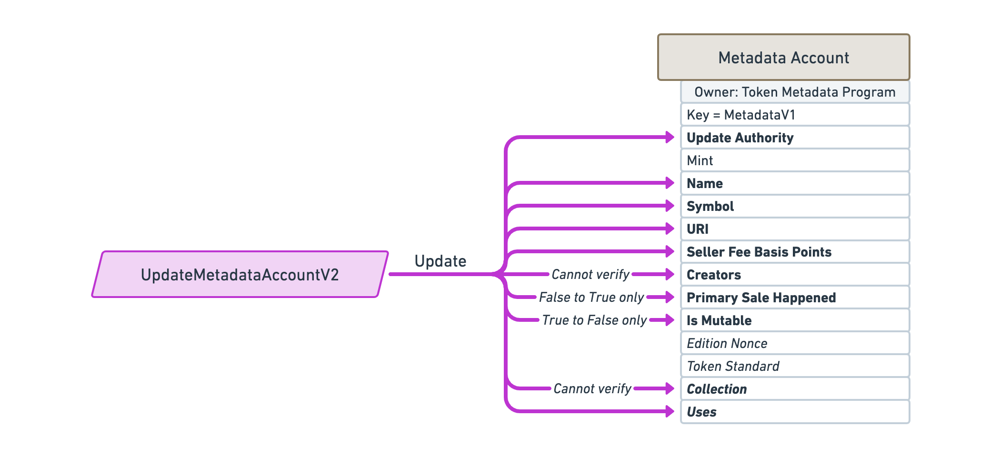
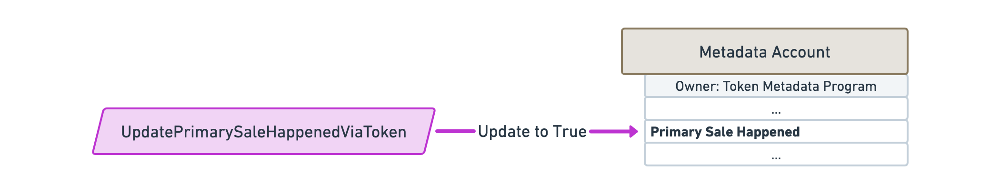
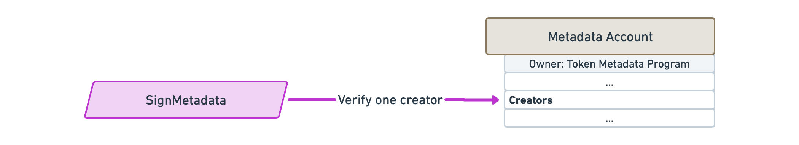
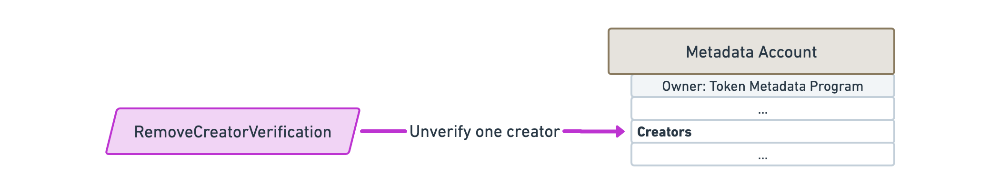
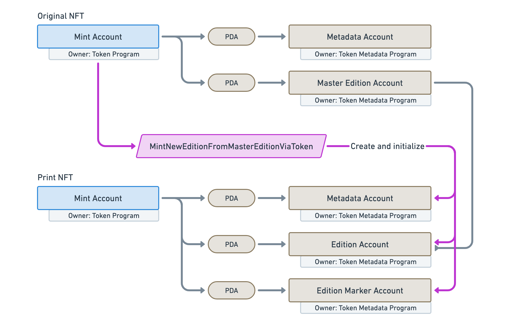
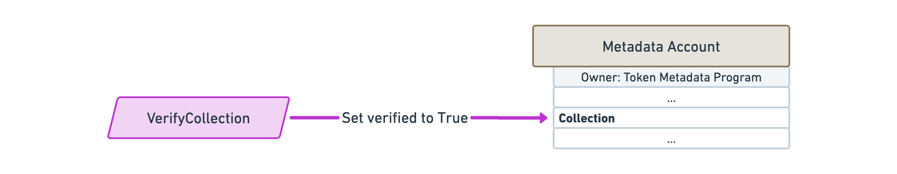
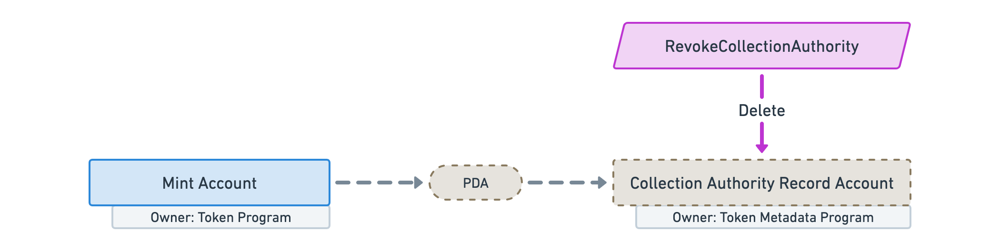
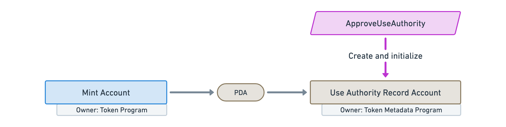

import ProgramInstruction from '../../../src/program-instruction.jsx';
import idl from './idl.js';

# Instructions

## Create a Metadata account

<ProgramInstruction idl={idl} instruction="CreateMetadataAccountV2">

This instruction creates and initializes a new [Metadata](./accounts#metadata) account for a given Mint account. It is required that the Mint account has been created and initialized by the Token Program before executing this instruction.

</ProgramInstruction>

## Update a Metadata account

<ProgramInstruction idl={idl} instruction="UpdateMetadataAccountV2">

This instruction enables us to update parts of the Metadata account. Note that some fields have constraints limiting how they can be updated. For instance, once the `Is Mutable` field is set to `False`, it cannot be changed back to `True`.

</ProgramInstruction>

## Indicate the primary sale has happened

<ProgramInstruction idl={idl} instruction="UpdatePrimarySaleHappenedViaToken">

This instruction flips the `Primary Sale Happened` flag to `True`, indicating that the first sale has happened. Note that this field is [indicative](/programs/understanding-programs#indicative-fields) and is typically used by marketplaces to calculate royalties.

</ProgramInstruction>

## Verify a creator

<ProgramInstruction idl={idl} instruction="SignMetadata">

This instruction verifies one creator on the Metadata account. As long as the provided `Creator` account signs the transaction, the `Verified` boolean will be set to `True` on the appropriate creator of the `Creators` array.

</ProgramInstruction>

## Unverify a creator

<ProgramInstruction idl={idl} instruction="RemoveCreatorVerification">

This instruction unverifies one creator on the Metadata account. As long as the provided `Creator` account signs the transaction, the `Verified` boolean will be set to `False` on the appropriate creator of the `Creators` array.

</ProgramInstruction>

## Create a Master Edition account

<ProgramInstruction idl={idl} instruction="CreateMasterEditionV3">

This instruction creates and initializes a new [Master Edition](./accounts#master-edition) account for a given Mint account. It requires the following conditions to be met:

- The Mint account has been created and initialized by the Token Program.
- The Mint account has zero decimals.
- The Mint account has a supply of exactly 1 token.

If these conditions are met, **it will transfer the Mint Authority and the Freeze Authority from the Mint account** to the Master Edition PDA ([Check the FAQ to understand why](./faq#why-are-the-mint-and-freeze-authorities-transferred-to-the-edition-pdaO)).

</ProgramInstruction>

## Print a new Edition from a Master Edition

### Via owning the token

<ProgramInstruction idl={idl} instruction="MintNewEditionFromMasterEditionViaToken">

Given a Masted Edition, this instruction creates a new Edition derived from a new Mint account.

It requires the owner of the Master Edition's Token account to sign the transaction, to prove they are allowed to print new editions from it.

It requires the same conditions as the Master Edition account regarding the Mint account and it will also **transfer the Mint Authority and the Freeze Authority from the Mint account** to the new Edition PDA ([Check the FAQ to understand why](./faq#why-are-the-mint-and-freeze-authorities-transferred-to-the-edition-pda)).

</ProgramInstruction>

### Via a Vault proxy

<ProgramInstruction idl={idl} instruction="MintNewEditionFromMasterEditionViaVaultProxy">

This instruction is very similar to the one above but it uses a Vault proxy instead of a Token account to prove we are allowed to print new editions from the given Master Edition.

It requires the same conditions as the Master Edition account regarding the Mint account and it will also **transfer the Mint Authority and the Freeze Authority from the Mint account** to the new Edition PDA ([Check the FAQ to understand why](./faq#why-are-the-mint-and-freeze-authorities-transferred-to-the-edition-pda)).

</ProgramInstruction>

## Verify the collection

<ProgramInstruction idl={idl} instruction="VerifyCollection">

This instruction verifies the collection of a Metadata account. As long as the provided `Collection Authority` is allowed to update the parent collection and signs the transaction, the `Verified` boolean will be set to `True` on the `Collection` field.

</ProgramInstruction>

## Unverify the collection

<ProgramInstruction idl={idl} instruction="UnverifyCollection">

This instruction unverifies the collection of a Metadata account. As long as the provided `Collection Authority` is allowed to update the parent collection and signs the transaction, the `Verified` boolean will be set to `False` on the `Collection` field.

</ProgramInstruction>

## Set and verify the collection

<ProgramInstruction idl={idl} instruction="SetAndVerifyCollection">

This instruction updated the `Collection` field of a Metadata account using the provided `Collection Mint` account as long as its `Collection Authority` signs the transaction.

</ProgramInstruction>

## Approve a new Collection Authority

<ProgramInstruction idl={idl} instruction="ApproveCollectionAuthority">

This instruction allows the provided `New Collection Authority` account to update the `Collection` field of a Metadata account.

The program keeps track of all the collection authorities that have been approved using [Collection Authority Record](./accounts#collection-authority-record) PDAs.

</ProgramInstruction>

## Revoke an existing Collection Authority

<ProgramInstruction idl={idl} instruction="RevokeCollectionAuthority">

This instruction revokes an existing collection authority, meaning they will no longer be able to update the `Collection` field of the Metadata account associated with that Mint account.

It does this by deleting the provided `Collection Authority Record` PDA.

</ProgramInstruction>

## Reduce the number of uses

<ProgramInstruction idl={idl} instruction="Utilize">

This instruction reduces the number of uses of a Metadata account.

This can either be done by the `Update Authority` of the Metadata account or by an approved `Use Authority`.

</ProgramInstruction>

## Approve a new Use Authority

<ProgramInstruction idl={idl} instruction="ApproveUseAuthority">

This instruction allows the provided `User` account to utilize a Metadata account.

The program keeps track of all the use authorities that have been approved via [Use Authority Record](./accounts#use-authority-record) PDAs.

</ProgramInstruction>

## Revoke an existing Use Authority

<ProgramInstruction idl={idl} instruction="RevokeUseAuthority">

This instruction revokes an existing use authority, meaning they will no longer be able to reduce the uses of the Metadata account associated with that Mint account.

It does this by deleting the provided `Use Authority Record` PDA.

</ProgramInstruction>

## Freeze the token account as a delegate

<ProgramInstruction idl={idl} instruction="FreezeDelegatedAccount">

This instruction freezes a Token account but only if you are the Delegate Authority of the Token account.

Because Mint Authority and Freeze Authority of NFTs are transferred to the Master Edition / Edition PDA, this instruction is the only way for a delegate to prevent the owner of an NFT to transfer it.

This enables a variety of use-cases such as preventing someone to sell its NFT whilst being listed in an escrowless marketplace.

Here's a small guide on [how to freeze a Token account using this instruction](https://github.com/metaplex-foundation/metaplex-program-library/issues/470#issuecomment-1132700105).

</ProgramInstruction>

## Thaw the token account as a delegate

<ProgramInstruction idl={idl} instruction="ThawDelegatedAccount">

This instruction reverts the instruction above by unfreezing a Token account, only if you are the Delegate Authority of the Token account.

</ProgramInstruction>

## Add padding to Metadata account fields

<ProgramInstruction idl={idl} instruction="PuffMetadata">

This instruction adds padding to the `Name`, `Symbol` and `URI` strings of the provided Metadata account. As a result, these fields will have a fixed size and will be easier to filter.

Note that, this is automatically done by the Token Metadata program when creating and updating Metadata accounts. This instruction serves as a migration tool for old NFTs that do not have that padding.

</ProgramInstruction>

## Upgrade Master Edition from V1 to V2

<ProgramInstruction idl={idl} instruction="ConvertMasterEditionV1ToV2">

This instruction serves as a migration tool that upgrades a Master Edition account of an NFT from V1 to V2.

</ProgramInstruction>
