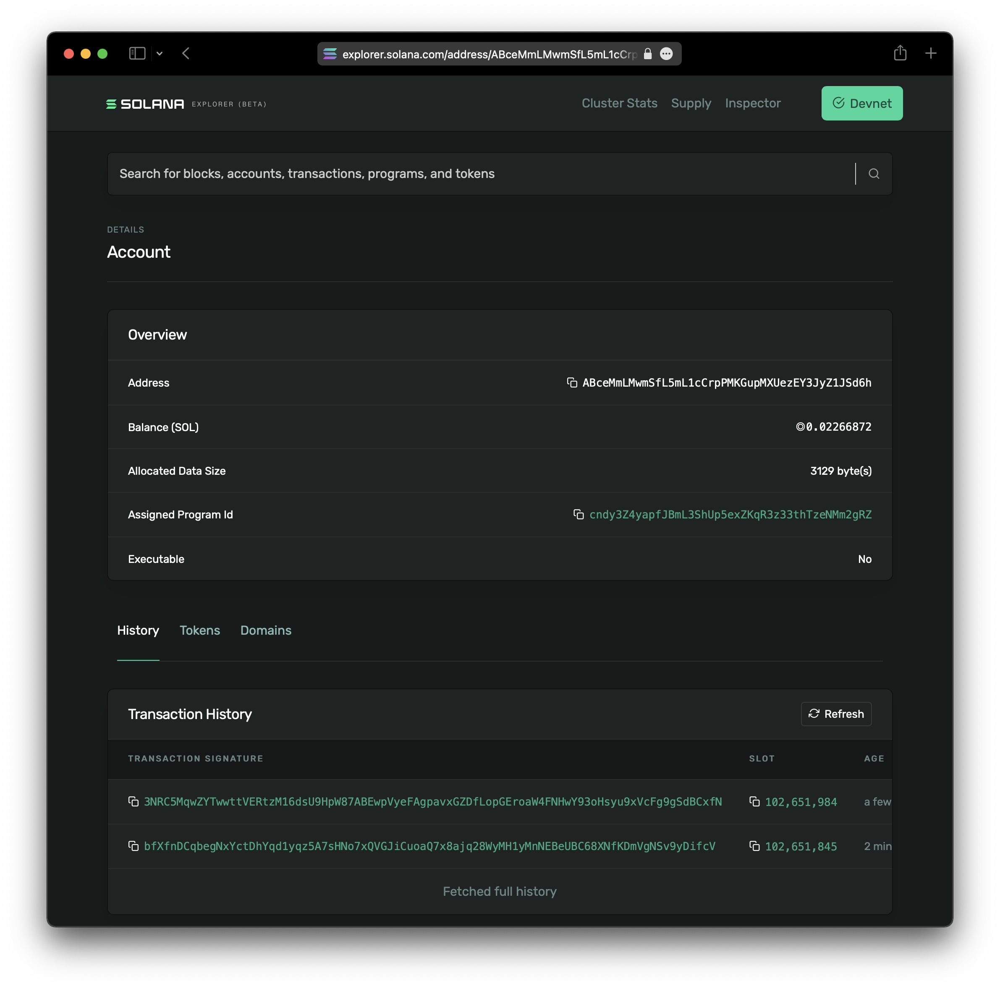

# Creating the Candy Machine

Once you have your collection prepared, the next step is to upload your assets and create a Candy Machine. This step is completed by a single command via the Candy Machine CLI.

Before you can proceed, you need to check that:

- Your images and metadata are located in the same directory - in most cases this will be a directory named `assets`
- You have funds in your wallet - the command `solana balance` will tell your current balance
- You have created your Candy Machine configuration file (e.g., `config.json`)

:::caution

To create a Candy Machine, space is allocated on chain to temporarily store the names and URI links (mirroring what is in your `.json` file in the `.cache` directory). To store this data on chain, you are required to pay on chain rent costs. After your mint (or whenever you want to end it), you can run the `withdraw` command to **reclaim all of the rent costs**. Check the [withdraw section](./09-withdraw.md) for more details. For a 10k collection, the rent costs are approximately **16.7 SOL**. This scales linearly with the number of items in your collection. Thus, you can get an approximate on chain rent cost estimate by multiplying the number of items in your collection by **0.00167 SOL**.

:::

To proceed, you will execute the `upload` command:

```bash
ts-node ~/metaplex/js/packages/cli/src/candy-machine-v2-cli.ts upload \
    -e devnet \
    -k ~/.config/solana/devnet.json \
    -cp config.json \
    -c example \
    ./assets
```

:::warning

The upload is a network-intensive command, in particular when dealing with larger collections. We highly recommend using a custom RPC, which can be specified by the switch `--rpc-url <string>` in the `upload` command. You can find a list of custom RPC services in our [community docs](/guides/community#rpc).

:::

In this command we are specifying that we will run the upload in the `devnet` environment (`-e` option), we will use the wallet keypair `~/.config/solana/devnet.json` (`-k` option), the Candy Machine configuration file `config.json` (`-cp` option), the cache file suffix `example` (`-c` option) and upload our assets from the folder `./assets`.

:::info

By default, the Candy Machine will automatically generate a collection NFT that will be set during minting if you use a UI that supports this feature (such as the [frontend](./07-mint-frontend.md) provided by Metaplex). As long as your NFTs are mutable and you retain update authority, you will be able to change or remove the collection at any point in the future should you so desire. More details in [Candy Machine Collections](#candy-machine-collections).

:::

Depending on the size of the collection - number of items and/or size of the images - this command has the potential to fail multiple times but should not be a problem when executed again, it will resume from the point it stopped in the previous execution.

Below is a sample output of a successful upload and Candy Machine creation:

```
WARNING: The "arweave" storage option will be going away soon. Please migrate to arweave-bundle or arweave-sol for mainnet.

Beginning the upload for 10 (img+json) pairs
started at: 1640191406699
Size 10 { mediaExt: '.png', index: '0' }
Processing asset: 0
initializing candy machine
initialized config for a candy machine with publickey: ABceMmLMwmSfL5mL1cCrpPMKGupMXUezEY3JyZ1JSd6h
Processing asset: 0
Processing asset: 1
Processing asset: 2
Processing asset: 3
Processing asset: 4
Processing asset: 5
Processing asset: 6
Processing asset: 7
Processing asset: 8
Processing asset: 9
Writing indices 0-9
Done. Successful = true.
ended at: 2021-12-22T16:44:38.446Z. time taken: 00:01:11
```

Any execution that does not complete an upload successfully will have an output `Successful = false`. In this case, re-run the upload command until a successful execution is achieved.

:::info

It is common to receive `signatureUnsubscribe error: Invalid subscription id.` messages. This is not an error that affects the upload.

:::

The command also outputs the Candy Machine PublicKey, which you can verify on the [Solana Explorer](https://explorer.solana.com):



:::info

The example uses the `"arweave"` storage option as we are running it on the `devnet`. When running on `mainnet-beta`, check other storage options that better suit your project/needs.

:::

## Candy Machine Collections

Candy Machine now allows you to set an on-chain collection which will be set during mint, following the [on-chain collections specification](/programs/token-metadata/certified-collections) of the Token Metadata program.

:::info

Setting or removing a collection for a Candy Machine will **only** impact NFTs that have yet to be minted. This will **not** change NFTs from your Candy Machine that have already been minted.

:::

To set the collection for your Candy Machine, run the `set_collection` command:

```bash
ts-node ~/metaplex/js/packages/cli/src/candy-machine-v2-cli.ts set_collection \
    -e devnet \
    -k ~/.config/solana/devnet.json \
    -c example \
    -m C2eGm8iQPnKVWxakyo8QhwJUvYrZHKF52DPQuAejpTWG
```

Successful output example:

```
wallet public key: bob1upX2AoA7HAHzDTPMcYhWWnYJeMJturpswReqqP4
(node:7714) ExperimentalWarning: stream/web is an experimental feature. This feature could change at any time
(Use `node --trace-warnings ...` to show where the warning was created)
(node:7714) ExperimentalWarning: buffer.Blob is an experimental feature. This feature could change at any time
Candy machine address:  6KyiTBupdBKFRvppJFa7LHhNYyQet8uTci9PiMkb6Niw
Collection metadata address:  6KVxzViK7v3nMKJxsgTBCXoZAgWc7TPWUy5YszuPytDL
Collection metadata authority:  bob1upX2AoA7HAHzDTPMcYhWWnYJeMJturpswReqqP4
Collection master edition address:  8uK5BmKsGYyngQ81iFbXkSdbhN2cN4NZCzyXH18k6sBg
Collection mint address:  FyLAtLXi1UcyBNbmz6G9rcxT6Qg7HhoT9PsTitmkVsyE
Collection PDA address:  7ULQrCp4MWZ4dMoaGdY52cZucmq8vHJxpogFSJXK8ee1
Collection authority record address:  BHkQpLrDPq6JBAzW8nMHVP9Hz4L6P1rqtXNhR8EEo2Jq
set collection finished {
  collectionMetadata: '6KVxzViK7v3nMKJxsgTBCXoZAgWc7TPWUy5YszuPytDL',
  collectionPDA: '7ULQrCp4MWZ4dMoaGdY52cZucmq8vHJxpogFSJXK8ee1',
  txId: '2e9VytqDnDtATyK3tsAUQJSHuEHvZL2XDQmUEGm5MuTG7jSgMfZxUjXLosJnWc7WeQCyhpktZRJxpXFsN6rJDwPd'
}
```

The `-m` option is the mint account of the collection NFT you want to set for your Candy Machine. This is the same account as the one you would see in mint/hash lists.

If you have already set a collection for your Candy Machine, you can also remove it with the `remove_collection` command:

```bash
ts-node ~/metaplex/js/packages/cli/src/candy-machine-v2-cli.ts remove_collection \
    -e devnet \
    -k ~/.config/solana/devnet.json \
    -c example
```

Successful output example:

```
wallet public key: bob1upX2AoA7HAHzDTPMcYhWWnYJeMJturpswReqqP4
(node:14972) ExperimentalWarning: stream/web is an experimental feature. This feature could change at any time
(Use `node --trace-warnings ...` to show where the warning was created)
(node:14972) ExperimentalWarning: buffer.Blob is an experimental feature. This feature could change at any time
Candy machine address:  6KyiTBupdBKFRvppJFa7LHhNYyQet8uTci9PiMkb6Niw
Authority address:  bob1upX2AoA7HAHzDTPMcYhWWnYJeMJturpswReqqP4
Collection PDA address:  7ULQrCp4MWZ4dMoaGdY52cZucmq8vHJxpogFSJXK8ee1
Metadata address:  6KVxzViK7v3nMKJxsgTBCXoZAgWc7TPWUy5YszuPytDL
Mint address:  FyLAtLXi1UcyBNbmz6G9rcxT6Qg7HhoT9PsTitmkVsyE
Collection authority record address:  BHkQpLrDPq6JBAzW8nMHVP9Hz4L6P1rqtXNhR8EEo2Jq
remove collection finished {
  collectionMetadata: '6KVxzViK7v3nMKJxsgTBCXoZAgWc7TPWUy5YszuPytDL',
  collectionPDA: '7ULQrCp4MWZ4dMoaGdY52cZucmq8vHJxpogFSJXK8ee1',
  txId: '32EseQPvZzcyVtpj4Sse2RoeAsU5akwbLL2v36W6CBEx6Jh9okmH4yR4XyfRAQKujmt7aKvYJ4GjNhp7ddnowm7D'
}
```

:::caution

While it's not possible for the user minting to set the NFTs to a separate collection, as of today it is possible for minters to avoid setting the collection by using alternate UIs/CLIs (likely from bots). Since you will have update authority on your NFTs, you can add the collection after the fact if NFTs were not minted from the Candy Machine with the collection. You can do this easily using https://collections.metaplex.com. We suggest you use this tool after your Candy Machine has minted out, although you can do it earlier if you want.

:::
