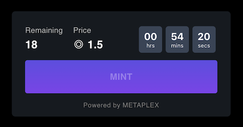
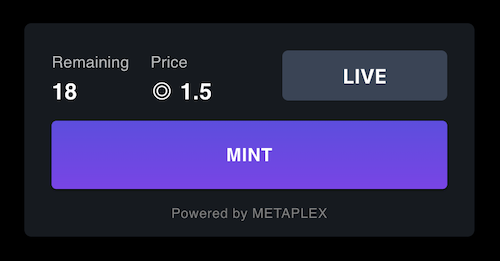
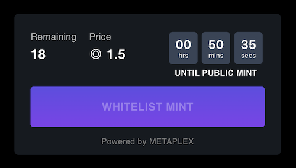
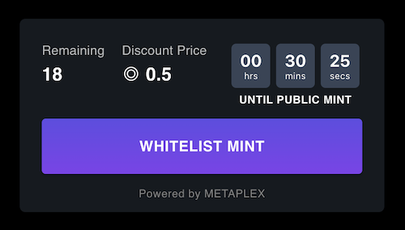
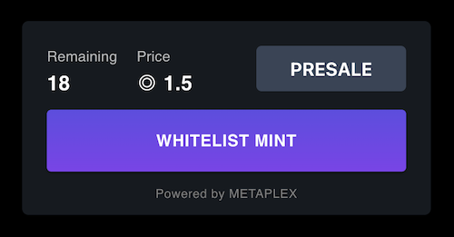
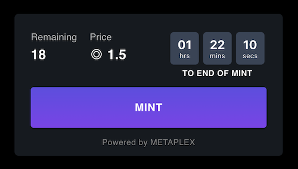

# A Front End Minting Experience

While the Candy Machine is ready to mint, in most cases you will want to provide a front end experience to allow your community the chance to mint, too.

You can use the Candy Machine v2 UI, which is already in the Metaplex repository and downloaded when you executed the `git clone` command.

## Setting up

Open the file `.env.example` located in the folder `~/metaplex/js/packages/candy-machine-ui` and modify the following:

- Set the value of `REACT_APP_CANDY_MACHINE_ID` to match the `ID` of your Candy Machine. The `ID` was in the output of the `upload` command and can also be found inside your Candy Machine cache file - this is located in the same directory that you executed the `upload` command (e.g., `.cache/devnet-example`)
- Specify the intended network you wish to use. In this example we are using the `devnet`:
    ```bash
    REACT_APP_CANDY_MACHINE_ID=<YOUR CANDY MACHINE PROGRAM ID>

    REACT_APP_SOLANA_NETWORK=devnet
    REACT_APP_SOLANA_RPC_HOST=https://metaplex.devnet.rpcpool.com/
    ```
- Once your `REACT_APP_CANDY_MACHINE_ID` has been updated. Rename `.env.example` to `.env`

:::warning

The public RPC endpoints (`https://api.mainnet-beta.solana.com` and `https://api.devnet.solana.com`) are not suitable for Candy Machine mints and may cause significant issues to your minting site. We **strongly** recommend that you use a custom RPC endpoint for your mint. You can find more information about the custom RPC solutions in the RPC section of our [community docs](/guides/community#rpc).

:::

After these changes are made, run the command `yarn install && yarn start` inside the folder `~/metaplex/js/packages/candy-machine-ui`. This will start a local server with a front end experience.  From here, you should customize the mint page and deploy it in your host service. 

:::warning

We **strongly** recommend that you keep the standard implementation for the mint button functionality when using captcha (`gatekeeper`) settings. This will guarantee that the captcha tokens are issued at the correct time (e.g., after the mint begins). The `CMv2` is designed to reject captcha tokens that are created before the mint is live to avoid bots pre-solving captchas - your transaction will fail if the token is created at the wrong time.

:::

## User Interface

The UI supports all different configurations of your Candy Machine v2, including whitelist (presale + discount) and end settings&mdash;e.g., it automatically adapts the UI components depending on whether the whitelist token is detected or not, discount for whitelist users is set and displays a countdown to the end of mint when end settings `"date"=true` is used.

### Default Mint

Before `goLiveDate` is reached:



When mint is live:



### Whitelist Mint

Whitelist token not detected, mint is not active before `goLiveDate`:



Whitelist token detected and whitelist settings set to presale and discount price:



Whitelist only mint:


Whitelist + presale and `goLiveDate` set to `null`:



### End Settings Mint

Countdown to the end of the mint:



End settings `date` reached, mint stopped:

