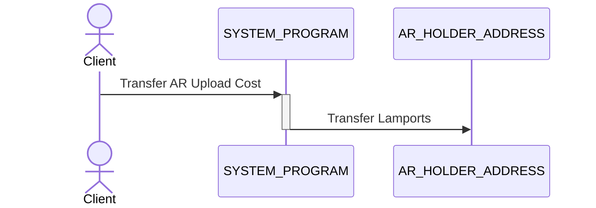
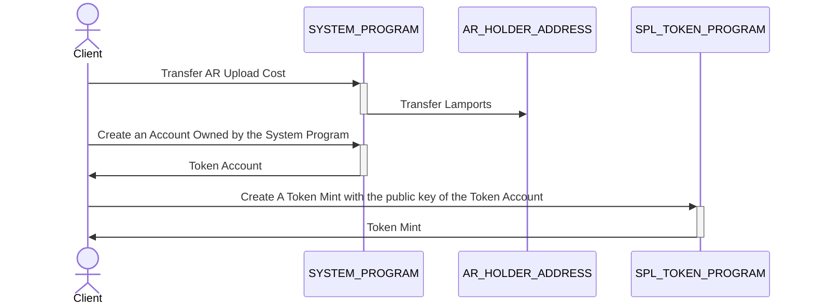
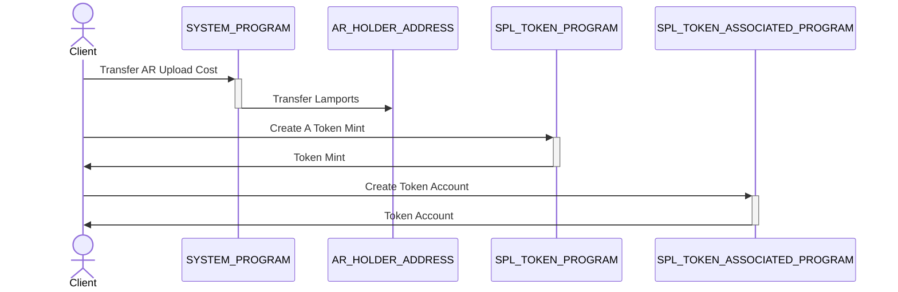
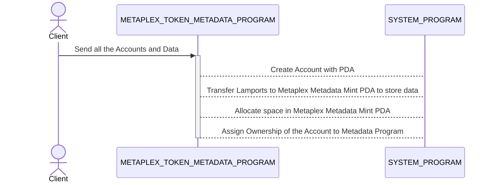
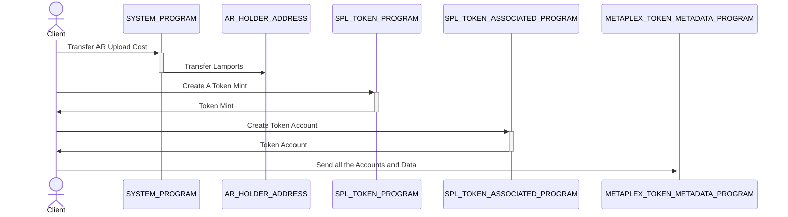
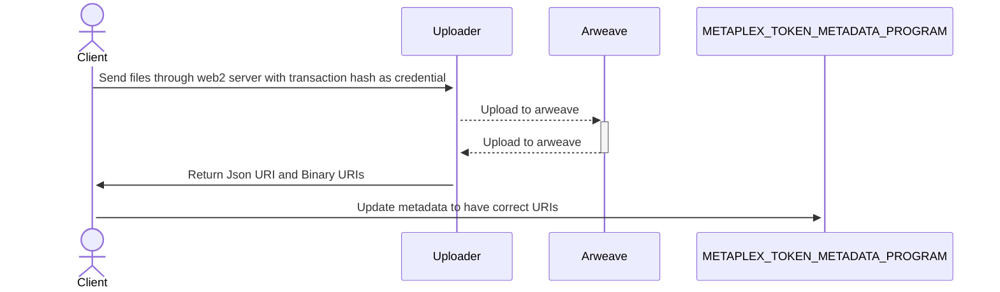
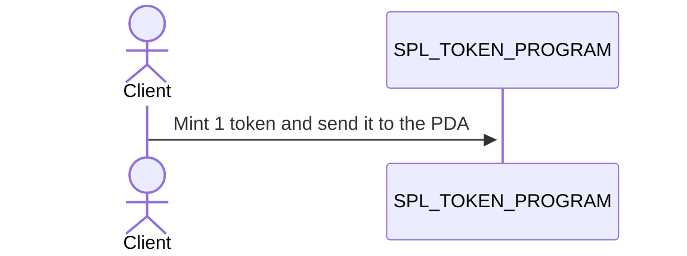
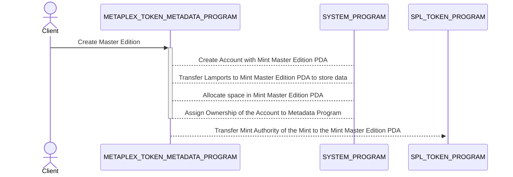
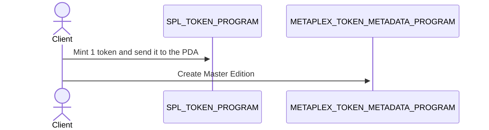

# Basic Single Item Auction End To End

Now that we've gone over the contracts, let's run through an example of how the contracts interact to create an NFT and sell it. I personally find these stories the most informative way to learn a new ecosystem.

### 1. Minting an NFT

On the Solana network an NFT is represented as a Token with only 1 in circulation and further minting is disabled, but that's not very useful. A token contains very little data about itself. In fact it doesn't even know its own name. Solana tokens are a primitive construct that we build on top of. That's where Metaplex comes in. As we mentioned on our [Terminology Page](/terminology#non-fungible-tokens) Metaplex is the standard way to add metadata to tokens. This metadata allows the tokens to secure Images, Audio, Video and anything else you can dream up. In order to create an NFT using metaplex we will follow these steps:

1. Optional: Pay for the Upload
2. Creating a Token Mint
3. Optional: Creating A Token Associated Account - This is a special type of account that allows you to receive a token or tokens made by a mint.
4. Creating A Token Metadata Account
5. Upload the Files
6. Mint one Token
7. Create Master Edition

We are breaking these steps down to make it easier to follow. Steps 1-4 happen as one Transaction on the Solana network, and Steps 6-7 are also just one transaction. Lets dive into each step.

#### Pay For the Upload

Ironically, the actual file upload is one of the last things to happen. Nothing is free, and uploading NFT content is no exception, so we currently need a way to pay for the file(s) to be store on Arweave. To do this we need to transfer lamports(tiny fractions of a SOL token) to a specific wallet address. This wallet address is connected to a Web2 web application that handles the file upload and the payment to Arweave. This step is only needed in the frontend, as you can specify the URI without going through Arweave

Here is a visual representation of what happened

> NOTE: This approach is more centralized than many would prefer, Metaplex hopes to improve this and make it more decentralized, and remember there is nothing stopping you from hosting your NFT content differently. Metaplex is open source so change it and make it better for everyone.

#### Creating the Token Mint

A token mint is how you make tokens, a mint that has a supply of 1 only allows you to make one token. When we make the mint, we are not actually making the token, but a container that can make tokens. In Solana, accounts are like containers for data, like a file. To create a mint you need to create an account in Solana that "holds" the mint.

Adding to our diagram we see the Mint created.

#### Optional: Creating A Token Associated Account

This step is necessary only when your wallet will need to hold the Token after the first MasterEdition( We will get to this later) or Prints become minted. On the Metaplex frontend, currently this is needed when you are manually uploading and creating an NFT. Without this Account your wallet could not receive the Token.
We keep adding to our diagram to show the Token Associated Account creation.

#### Creating A Token Metadata Account

As we said above the steps we have gone through thus far are represented as one transaction on the Solana network. These are called instructions, and this is the last set of instructions before we hit the network. This step is the backbone of Metaplex. This allows us to store additional information with a Token. There are a lot of variables needed to execute these set of instructions, lets go through them. In the frontend, the uris are blank and then updated after the actual upload to ARWEAVE succeeds.

1. The Data - this is a blob of data that conforms to the [Token Metadata Standard](/programs/token-metadata/token-standard).
2. Your Public Key
3. A Metadata program Derived account Address - Read more about PDAs here. This is a uninitialized address that the account will be stored at. We do this so we can deterministically find this address again in the future.
4. The mint account public key

Lets look at an in depth diagram of the CreateAccountMetadata program and what it does.

This adds to our ever growing diagram to complete Transaction 1.

All of these instructions are bundled up into one transaction and sent over RPC to the Solana network. At the end of this transaction you have completed steps 1-4 and the transaction id that you get back from the network will help you in the next step.

#### Upload the Files

If you are using the frontend, after the above transaction succeeds you will get a Transaction ID. This ID will then be used as a credential to the Web2 uploading system. This system checks the transaction id, mint key and files for validity and size. It then uploads them to arweave and finishes paying arweave out of the SOL you transferred to the special upload wallet.

If you are not using the frontend then this step may not be necessary for you.

#### Mint One Token

Finally, the mint! We will now begin building the second transaction starting with the `MintTo` instruction. MintTo needs to be passed some data in order to function, it needs the following:

1. The Mint address - this is the public key of the account we made to store the mint.
2. The destination address - this is that PDA(Program Derived Address) that we used to store the Token MetaData, and it is now the address or public key of the Token Metadata Account.
3. Your public key - since you are the Minting Authority or Owner of the mint, you have the ability to mint.
4. An amount, in this case 1

We will start fresh with our transaction diagram.

#### Create Master Edition

In Metaplex, you can make an NFT that is a true one-of-a-kind token, but you can also use the `MasterEdition` construct to create `Prints` of the master edition, just like a painting. You now want to label this token account as a MasterEdition NFT that has a limited supply of 10 possible Limited Edition Prints. Cool! Remember that the point of Metadata is to label mints - not just NFTs. To do this you call the `create_master_edition` endpoint on the Token Metadata Program. By doing this, minting authority is taken away from you, and it creates a new Master Edition PDA that contains information about how large a supply you want to have.

Lets do a deep dive on this Program.

When you want to mint Editions now, you'll need to present a token account containing the token from this Master Edition mint as proof of ownership and authority to do so. This is why we will later hand this token over to the Auction Manager, so that it can do the same to print off Editions for winners!

Lets take a look at our transaction diagram now.

The above instructions will get bundled up into one instruction and sent to the Solana network. Once successful your token account has a bonafide NFT Master Edition in it, we can run an auction where we auction off Limited Edition prints! Let's say we want to auction off three such prints.

### 2. The Auction

5. Next, we create a token vault using the `init_vault` endpoint of the token vault contract. We'll store our master edition token in it by adding it to the vault using the `add_token_to_inactive_vault` endpoint. This will create a safety deposit box in the vault that contains the the token.
6. Then we will call the `activate_vault` command which **Activates** the vault, locking everything inside.
7. We now **Combine** the vault using `combine_vault`, which is to say, we "open it," so the current authority could, if they wanted, withdraw the tokens inside it. The Auction Manager can only work with vaults in this state, which is why we have to go through the **Activation** phase to get here even though it seems a little nonsensical. [See the in depth guide](./deep_dive/token_vault) for more color on why these different states exist.
8. Next up, we create the auction, and we say its resource is this vault. The auction has not yet been started, but it has the right resource (the vault). We do this via the `create_auction` command on the Auction contract.
9. Now that we have an auction and a vault, we can go and call the `init_auction_manager` endpoint on the Metaplex contract with both of these accounts among a few others to create an AuctionManager, which ties them both together. Note that `init_auction_manager` takes a special struct called AuctionManagerSettings that allows one to specify how many winners there are and what winners get which items from which safety deposit box. At this point, we can't yet start the auction. The AuctionManager is in an invalidated state and we need to validate it. We do this by validating that the safety deposit boxes we provided to it in the vault have actually what we said are in them when we provided the AuctionManager with it's settings struct.
10. Before we begin validation, we call `set_authority` on both the vault and auction to change its authority to the auction manager, so that it has control over both of those structs. This is a requirement for the validation phase and the rest of the contract lifecycle. **Now you no longer have control over your items.**
11. We call the `validate_safety_deposit_box` endpoint on the Metaplex contract with the one safety deposit box in the vault, and the logic in this endpoint checks that there are exactly 3 printing tokens from the right mint in this box, matching the 3 printing tokens we promised it would have in our AuctionManagerSettings. Once we do this, and because this is the only safety deposit box in the vault, the AuctionManager is now validated.
12. We now call `start_auction` on the Metaplex contract, which, because the AuctionManager has authority over the Auction, calls `start_auction` on the Auction contract, and the auction begins!
13. Users can go and call `place_bid` on the Auction contract to place bids. When they do this, tokens of the `token_mint` type used by the auction are taken from the account they provide, tied to their main wallet, and stored in bidder pot accounts in the auction contract.
14. In order to update a bid, a user must first cancel the original bid, and then place a new bid.
15. Once the auction is over, a user can refund their bid if they did not win by calling `cancel_bid` again. Winners of the auction cannot cancel their bids.
16. The winner of a bid creates a mint with decimals 0, a token account with 1 token in it, and calls the `redeem_printing_v2_bid` endpoint on the Metaplex contract, all in a single transaction. This token is now _officially_ a Limited Edition of the "Bob's Cool NFT" Master Edition NFT!
17. You, the auctioneer, visit /#/auction/id/billing and hit the settle button. This first iterates over all three bidders and for each wallet used, calls `claim_bid` on the Metaplex contract, which proxy-calls a `claim_bid` on the Auction contract, telling it to dump the winner's payment into an escrow account called `accept_payment` on the AuctionManager struct. It has the same token type as the auction. Once all payments have been collected, the front end then calls the `empty_payment_account` endpoint one time (since you are the only creator on the Metadata being sold) and the funds in this escrow are paid out to a token account provided of the same type owned by you.

    Note that our front end reference implementation uses SOL as the "token type." This has some special caveats, namely that SOL isn't really an "spl token." It instead has a work-around called the "Wrapped SOL mint." This is a special mint that is often used in a transient account. What this means is that when we place a bid, we actually make a one-off system account, transfer lamports to it of your bid amount + rent, then label it an spl-token account of the wrapped sol type, use it to place the bid, then close it all in one transaction.

    Special machinations in the spl token program then make this wrapped sol token account have a number of tokens with the proper decimals that map to the amount of SOL you transferred to it. We do a similar operation with cancelling, where we make a transient wrapped sol account, transfer cancelled bid funds to it, and then close the account, transferring funds out all in a single transaction. This is all done for ease of use. With settlements, when funds are disbursed to artists, we actually make a WSOL account for them and they have to close it by hand via a dropdown menu.

    The protocol operates off of generic spl tokens and has no opinions about WSOL specifically, but the front end reference implementation does. So take careful note!
