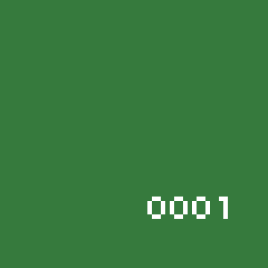

# Preparing your Assets

The Candy Machine is a distribution program and in order to use it to mint NFTs, it needs to be loaded up with your project's artwork and metadata.

Your assets consist of a collection of images (e.g., `.png`) and metadata (`.json`) files organized in a 1:1 mapping - i.e., each image has a corresponding metadata file.

There are a multitude of unique ways to generate images and metadata, and in most scenarios, you will automate this process. In this guide we will cover the creation of a simple collection to illustrate the metadata requirements and Candy Machine distribution. You should familiarize yourself with the [Metaplex Token Metadata Standard](https://docs.metaplex.com/nft-standard).

## Example NFT Collection

A 10-item collection will have 20 files in total:

| Images | Metadata|
|--------|---------|
|`0.png` | `0.json`|
|`1.png` | `1.json`|
|`2.png` | `2.json`|
|`3.png` | `3.json`|
|`4.png` | `4.json`|
|`5.png` | `5.json`|
|`6.png` | `6.json`|
|`7.png` | `7.json`|
|`8.png` | `8.json`|
|`9.png` | `9.json`|

Each pair `0.png` and `0.json` are combined to represent the first NFT in this example collection; `1.png` and `1.json` describe the second NFT and so forth. Theses files are typically grouped into a single folder, usually named `assets`, but that is not a hard requirement. Grouping them into a single folder simplifies next steps and is highly encouraged.

The content of the image files reflect the artwork you would like to display for each NFT and the content of the metadata files describe each of these pieces of artwork using the schema defined in the [Metaplex Token Metadata Standard](https://docs.metaplex.com/nft-standard).

> The first item in your collection must have the index `0`, the second `1` and so forth. In a `10000` NFT drop, will start with the pair `0.png` and `0.json`, and end with the pair `9999.png` and `9999.json`. The numbering must also be consecutive - i.e., should not have gaps in the numbering.

### Example Items of the Collection

Below are two simple examples of items in this collection:

#### • Image: `0.png`



#### • Metadata: `0.json`

```json
{
    "name": "Number #0001",
    "symbol": "NB",
    "description": "Collection of 10 numbers on the blockchain. This is the number 1/10.",
    "seller_fee_basis_points": 500,
    "image": "0.png",
    "attributes": [
        {"trait_type": "Layer-1", "value": "0"},
        {"trait_type": "Layer-2", "value": "0"}, 
        {"trait_type": "Layer-3", "value": "0"},
        {"trait_type": "Layer-4", "value": "1"}
    ],
    "properties": {
        "creators": [{"address": "N4f6zftYsuu4yT7icsjLwh4i6pB1zvvKbseHj2NmSQw", "share": 100}],
        "files": [{"uri": "0.png", "type": "image/png"}]
    },
    "collection": {"name": "numbers", "family": "numbers"}
}
```

#### • Image: `9.png`


#### • Metadata: `9.json`

```json
{
    "name": "Number #0010",
    "symbol": "NB",
    "description": "Collection of 10 numbers on the blockchain. This is the number 10/10.",
    "seller_fee_basis_points": 500,
    "image": "9.png",
    "attributes": [
        {"trait_type": "Layer-1", "value": "0"},
        {"trait_type": "Layer-2", "value": "0"}, 
        {"trait_type": "Layer-3", "value": "1"},
        {"trait_type": "Layer-4", "value": "0"}
    ],
    "properties": {
        "creators": [{"address": "N4f6zftYsuu4yT7icsjLwh4i6pB1zvvKbseHj2NmSQw", "share": 100}],
        "files": [{"uri": "9.png", "type": "image/png"}]
    },
    "collection": {"name": "numbers", "family": "numbers"}
}
```

Notice that the difference in the metadata between each image is on:

- `"name"` property: `"Number #0000"` in the first image and `"Number #0010"` in the last image
- `"description"` property: it shows `"number 1/10"` in the first image and `"number 10/10"` in the last image
- `"image"` property: `"0.png"` in the first image and `"9.png"` in the last image
- `"properties.files.uri"` property: `"0.png"` in the first image and `"9.png"` in the last image
- `"attributes"` property: the values for `"Layer-3"` and `"Layer-4"` trait-types are different, since they describe attributes of the images

It is also important to make sure that you set royalties percentage awarded to creators (`"seller_fee_basis_points"` property) is set and each creators' wallet is listed in the `"properties.creators"` property.

:::info
You can download the complete [sample collection](assets.zip) for testing and experimentation. Subsequent steps in this walkthrough will assume it's the collection in use.
:::