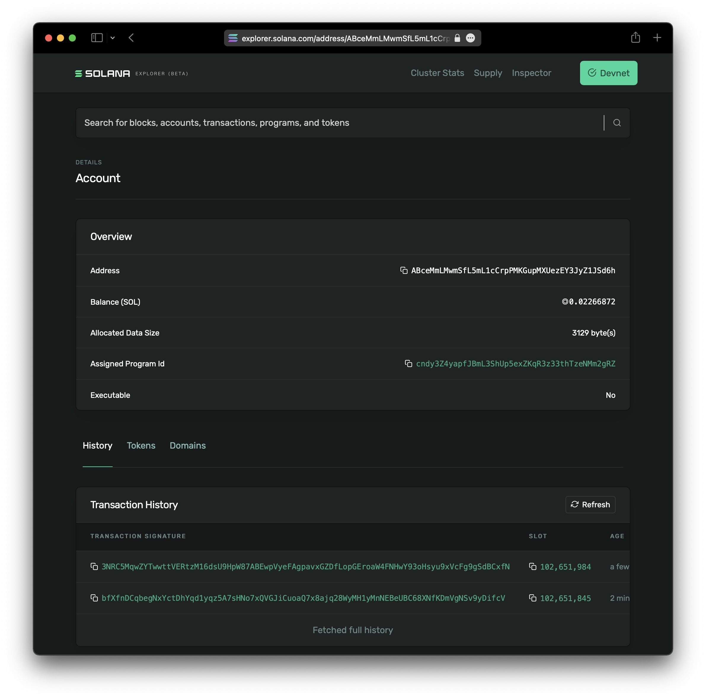

# Creating the Candy Machine

Once you have your collection prepared, the next step is to upload your assets and create a Candy Machine. This step is completed by a single command via the Candy Machine CLI.

Before you can proceed, you need to check that:

- Your images and metadata are located in the same directory - in most cases this will be a directory named `assets`
- You have funds in your wallet - the command `solana balance` will tell your current balance
- You have created your Candy Machine configuration file (e.g., `config.json`)

:::caution

To create a Candy Machine, space is allocated on chain to temporarily store the names and URI links (mirroring what is in your `.json` file in the `.cache` directory). To store this data on chain, you are required to pay on chain rent costs. After your mint (or whenever you want to end it), you can run the `withdraw` command to **reclaim all of the rent costs**. Check the [withdraw section](./09-withdraw.md) for more details. For a 10k collection, the rent costs are approximately **16.7 SOL**. This scales linearly with the number of items in your collection. Thus, you can get an approximate on chain rent cost estimate by multiplying the number of items in your collection by **0.00167 SOL**.  

:::

To proceed, you will execute the `upload` command:

```bash
ts-node ~/metaplex/js/packages/cli/src/candy-machine-v2-cli.ts upload \
    -e devnet \
    -k ~/.config/solana/devnet.json \
    -cp config.json \
    -c example \
    ./assets
```

:::warning

The upload is a network-intensive command, in particular when dealing with larger collections. We highly recommend using a custom RPC, which can be specified by the switch `--rpc-url <string>` in the `upload` command. You can find a list of custom RPC services in our [community docs](../community.md#RPC).

:::

In this command we are specifying that we will run the upload in the `devnet` environment (`-e` option), we will use the wallet keypair `~/.config/solana/devnet.json` (`-k` option), the Candy Machine configuration file `config.json` (`-cp` option), the cache file suffix `example` (`-c` option) and upload our assets from the folder `./assets`.

Depending on the size of the collection - number of items and/or size of the images - this command has the potential to fail multiple times but should not be a problem when executed again, it will resume from the point it stopped in the previous execution.

Below is a sample output of a successful upload and Candy Machine creation:

```
WARNING: The "arweave" storage option will be going away soon. Please migrate to arweave-bundle or arweave-sol for mainnet.

Beginning the upload for 10 (img+json) pairs
started at: 1640191406699
Size 10 { mediaExt: '.png', index: '0' }
Processing asset: 0
initializing candy machine
initialized config for a candy machine with publickey: ABceMmLMwmSfL5mL1cCrpPMKGupMXUezEY3JyZ1JSd6h
Processing asset: 0
Processing asset: 1
Processing asset: 2
Processing asset: 3
Processing asset: 4
Processing asset: 5
Processing asset: 6
Processing asset: 7
Processing asset: 8
Processing asset: 9
Writing indices 0-9
Done. Successful = true.
ended at: 2021-12-22T16:44:38.446Z. time taken: 00:01:11
```
Any execution that does not complete an upload successfully will have an output `Successful = false`. In this case, re-run the upload command until a successful execution is achieved.

:::info

It is common to receive `signatureUnsubscribe error: Invalid subscription id.` messages. This is not an error that affects the upload.

:::

The command also outputs the Candy Machine PublicKey, which you can verify on the [Solana Explorer](https://explorer.solana.com):



:::info

The example uses the `"arweave"` storage option as we are running it on the `devnet`. When running on `mainnet-beta`, check other storage options that better suit your project/needs.

:::
