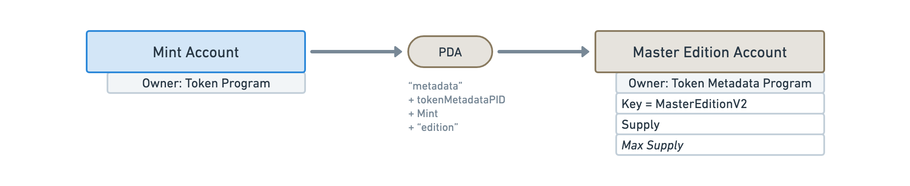

import ProgramAccount from '../../../src/program-account.jsx';
import accounts from './accounts.js';

# Accounts

## Metadata

<ProgramAccount account={accounts.metadata}>

The Metadata Account is responsible for storing the additional data attached to tokens. As every account in the Token Metadata program, it derives from the Mint Account using a PDA.

</ProgramAccount>

## Master Edition

<ProgramAccount account={accounts.master_edition}>

TODO

</ProgramAccount>

## Edition

<ProgramAccount account={accounts.edition}>

TODO

</ProgramAccount>

## Edition Marker

<ProgramAccount account={accounts.edition_marker}>

Edition Marker accounts are used internally by the program to **keep track of which edition were printed** for a given Master Edition.

Each Edition Marker account is responsible for storing a subset of the printed editions. More precisely, **they each store 248 editions using a bitmask** where `0` means, the edition has not been printed and `1` means it has. That means Master Edition accounts typically end up using more than one Edition Marker account.

To understand how this works, let's imagine that we want to print the 500th edition of a Master Edition.

To know if this edition has already been printed, we need to check the third Edition Marker account because the first two are keeping track of the first 496 editions (248 + 248 = 496) and should, at this point, be full of `1`s. Then, we can check the fourth bit of the third Edition Marker to see if the 500th edition has already been printed.

Therefore, we can find out if the `n`th edition was printed by checking the `n % 248`th bit of the `⌊n / 248⌋`th Edition Marker.

This is why `⌊n / 248⌋` is used as a seed of the Edition Marker PDA.

</ProgramAccount>

## Collection Authority Record

<ProgramAccount account={accounts.collection_authority_record}>

TODO

</ProgramAccount>

## Use Authority Record

<ProgramAccount account={accounts.use_authority_record}>

TODO

</ProgramAccount>
