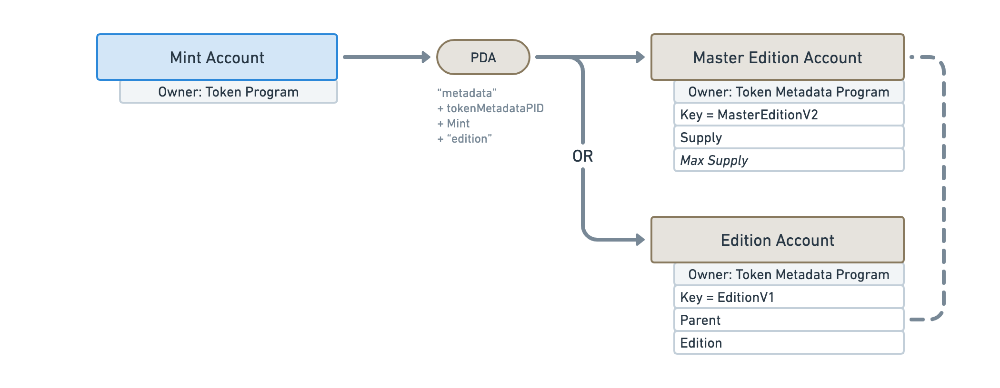
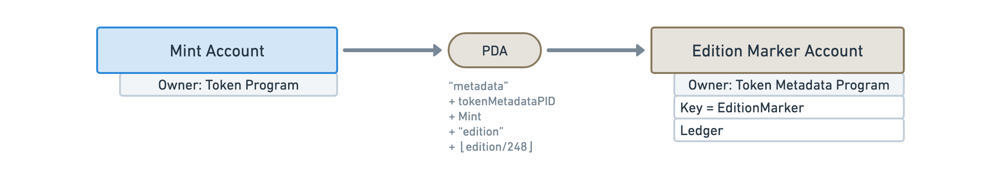

import ProgramAccount from '../../../src/program-account.jsx';
import accounts from './accounts.js';

# Accounts

## Metadata

<ProgramAccount account={accounts.metadata}>

The Metadata Account is responsible for storing the additional data attached to tokens. As every account in the Token Metadata program, it derives from the Mint Account using a PDA.

</ProgramAccount>

## Master Edition

<ProgramAccount account={accounts.master_edition}>

TODO

</ProgramAccount>

## Edition

<ProgramAccount account={accounts.edition}>

TODO

</ProgramAccount>

## Edition Marker

<ProgramAccount account={accounts.edition_marker}>

TODO

</ProgramAccount>

## Collection Authority Record

<ProgramAccount account={accounts.collection_authority_record}>

TODO

</ProgramAccount>

## Use Authority Record

<ProgramAccount account={accounts.use_authority_record}>

TODO

</ProgramAccount>
