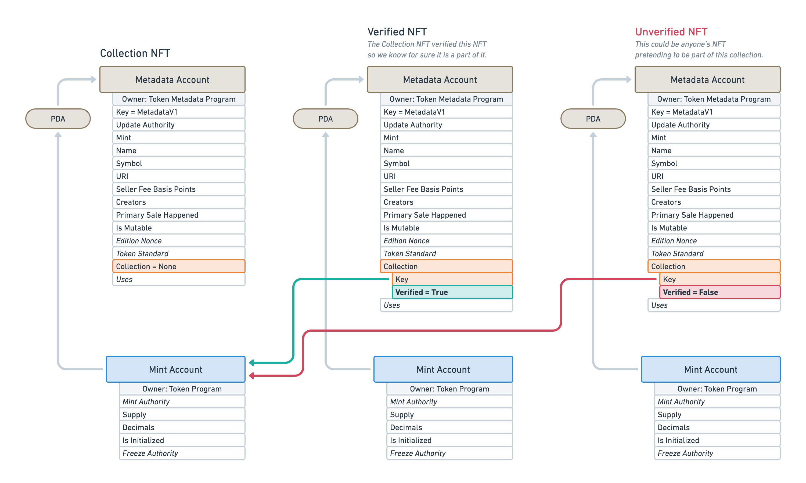

# Certified Collections

## Introduction

Certified Collections enables NFTs – and tokens in general — **to be grouped together** and for that information to be **verified on-chain**. Additionally, it makes it easier to manage these collections by allocating data for them on-chain.

This feature provides the following advantages:

- Easy to identify which collection any given NFT belongs to without making additional on-chain calls.
- Possible to find all NFTs that belong to a given collection ([Check the FAQ to see how](./faq#how-can-i-filter-metadata-accounts-by-collection-using-getprogramaccounts)).
- Easy to manage the collection metadata such as its name, description and image.

:::info

The on-chain Certified Collection feature has been added to the Token Metadata program in [version 1.1](./changelog/v1-1).

It replaces the `collection` field previously defined in external JSON metadata.

:::

## Collection NFTs

In order to group NFTs — or any token — together, we must first create a Collection NFT whose purpose is to store any metadata related to that collection. That's right, **a collection of NFT is, itself, an NFT**. It has the same data layout on-chain as any other NFT.

The difference between a Collection NFT and a Regular NFT is that the information provided by the former will be used to define the group of NFTs it contains whereas the latter will be used to define the NFT itself.

Collection NFTs and Regular NFTs are **linked together using a "Belong To" relationship** on the Metadata account. The optional `Collection` field on the Metadata account has been created for that purpose.

- If the `Collection` field is set to `None`, it means the NFT is not part of a collection.
- If the `Collection` field is set, it means the NFT is part of the collection specified within that field.

As such, the `Collection` field contains two nested fields:

- `Key`: This fields points to the Collection NFT the NFT belongs to. More precisely, it points to **the public key of the Mint Account** of the Collection NFT. This Mint Account must be owned by the SPL Token program.
- `Verified`: This boolean is very important as it is used to verify that the NFT is truly part of the collection it points to.

Notice that, because Collections and NFTs are linked together via a "Belong To" relationship, it is possible by design to define nested collections.

Also note that there is currently no way to distinguish between a Collection NFT and a Regular NFT that is part of a Collection. This is a limitation we are currently working on as part of [version 1.3](https://github.com/metaplex-foundation/metaplex-program-library/discussions/444).

## Verifying NFTs in Collections

As mentioned above, the `Collection` field contains a `Verified` boolean which is used to **determine if the NFT is truly part of the collection it points to**. Without this field, anyone could pretend their NFT to be part of any collection.

In order to flip that `Verified` boolean to `True`, the Authority of the Collection NFT must sign the NFT to prove that it is allowed to be part of the collection.

:::warning

**EXTREMELY IMPORTANT** 🚨

Explorers, Wallets and Marketplaces, **MUST CHECK** that `Verified` is true. `Verified` can only be set true if the Authority on the Collection NFT has run the `VerifyCollection` instruction over the NFT.

This is the exact same pattern as the `Creators` field where `Verified` must be true in order to validate the NFT.

In Order to check if a collection is valid on an NFT you **MUST**:

1. Check that the `Collection` struct is set.
2. Check that the `Key` in the `Collection` struct is owned on chain by the SPL Token program.
3. Check that `Verified` is true.

If those 3 steps are not followed you could be exposing fradulent NFTs on real collections.

:::

The following instruction are available to use to set, verified or unverified a NFT as part of a collection:

- [Verify the collection](./instructions#verify-the-collection)
- [Unverify the collection](./instructions#unverify-the-collection)
- [Set and verify the collection](./instructions#set-and-verify-the-collection)

## Delegating the Collection Authority

TODO

## Old doc

### Delegate Collection Authority Record

Update Authorities on a Collection NFT can delegate the authority to call the
`verify_collection` instruction. This allows you to delegate the ability to add
NFTs to your collection to many parties. You can do this by calling the
`approve_collection_authority` instruction. To revoke you can call the
`revoke_collection_authority` instruction.

To accomplish setting and verifying a collection with one instruction use the `set_and_verify_collection` instruction introduced in 1.2.0.

### Verify a collection using collections.metaplex.com

1. Visit [collections.metaplex.com](https://collections.metaplex.com/)
2. Connect your wallet, but first verify this wallet is the upgrade authority.
3. Select the cluster you want to work on devnet, mainnet, etc.
4. Click on create "Create a Collection"
5. Put in the name, symbol, logo, and description of your nft collection.
6. Choosing between the three options:
   1. "Individual NFTs" -> insert the mint address of your NFT
   2. "First verified creator" -> locate the candy machine address and insert this
   3. "CSV file" -> upload a csv file that contains the list of mint addresses. The csv file should contain all the mint ids, separated by commas with no spaces.
7. Then click "Create Collection" and two transactions approvals will be required. The first transaction approval will allow Metaplex to be the delegate to make the migration. The second transaction will be the crete the Parent NFT
8. After the Parent NFT is created the migration will start to begin. You can then close the tab and come back to it later with the same wallet to see the status.

:::warning

Always check Solana's Network before you start up a migration. You can check here https://solscan.io/

If a "Retry" button appears it could be due to a network congestion, so click retry and monitor the network.

If a "Fail to Migrate Collection" appears this is typically due to the wrong Upgrade Authority.

All other issues please visit our discord for further support.

:::

[Full Verified Collections Tutorial](https://drive.google.com/file/d/1VU4xL_yF6LCe0UogVn4As5PMAzUV__8C/view?usp=sharing)
