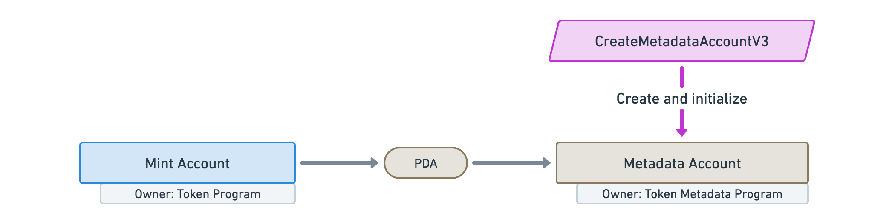
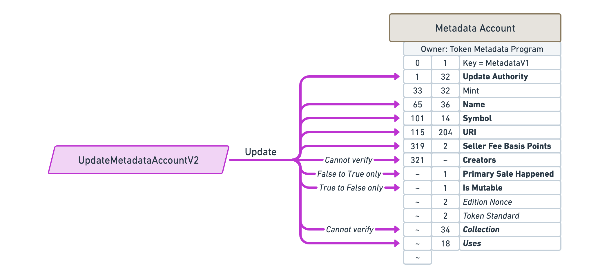
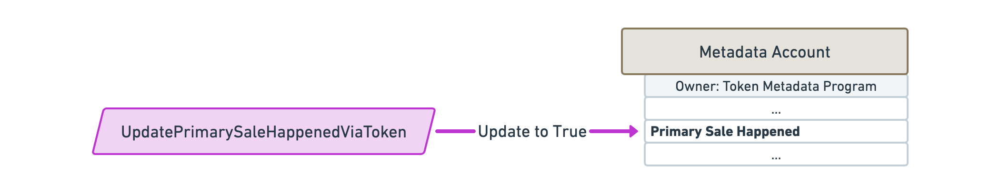
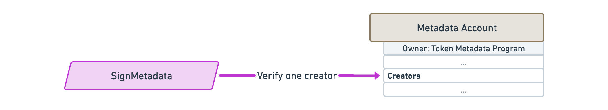
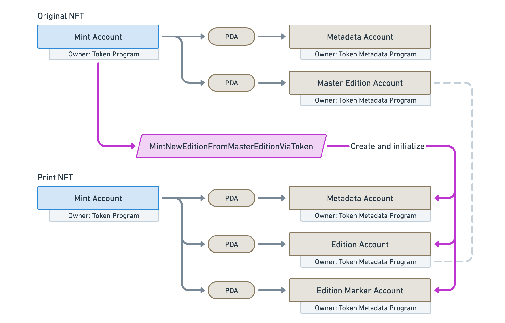
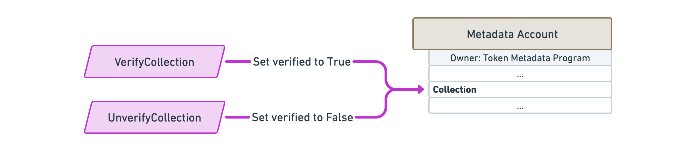

# Instructions

## Create a Metadata account

`CreateMetadataAccountV2`

TODO

## Update a Metadata account

`UpdateMetadataAccountV2`

TODO

## Indicate the primary sale has happened

`UpdatePrimarySaleHappenedViaToken`

TODO

## Verify a creator

`SignMetadata`

TODO

## Unverify a creator

`RemoveCreatorVerification`

TODO

## Create a Master Edition account

`CreateMasterEditionV3`

TODO

## Print a new Edition from a Master Edition

### Via owning the token

`MintNewEditionFromMasterEditionViaToken`

TODO

### Via a Vault proxy

`MintNewEditionFromMasterEditionViaVaultProxy`

TODO

## Verify the collection

`VerifyCollection`

TODO

## Unverify the collection

`UnverifyCollection`

TODO

## Set and verify the collection

`SetAndVerifyCollection`

TODO

## Approve a new Collection Authority

`ApproveCollectionAuthority`

TODO

## Revoke an existing Collection Authority

`RevokeCollectionAuthority`

TODO

## Reduce the number of uses

`Utilize`

TODO

## Approve a new Use Authority

`ApproveUseAuthority`

TODO

## Revoke an existing Use Authority

`RevokeUseAuthority`

TODO

## Freeze the token account as a delegate

`FreezeDelegatedAccount`

TODO: Freezes a token account that has been fully delegated.

## Thaw the token account as a delegate

`ThawDelegatedAccount`

TODO: Thaws a token account that has been fully delegated.

## Add padding to Metadata account fields

`PuffMetadata`

TODO

## Upgrade Master Edition from V1 to V2

`ConvertMasterEditionV1ToV2`

TODO
