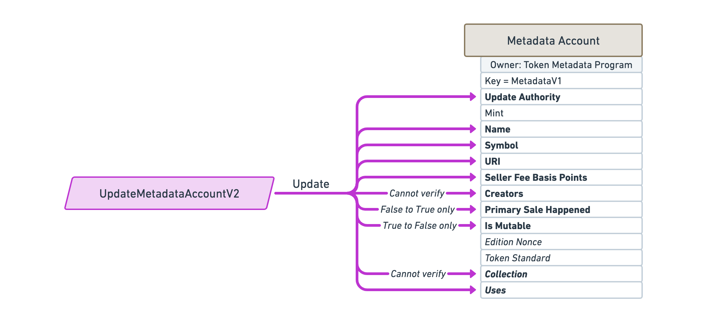
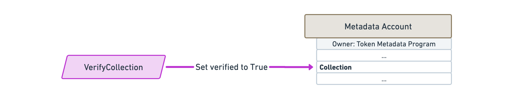
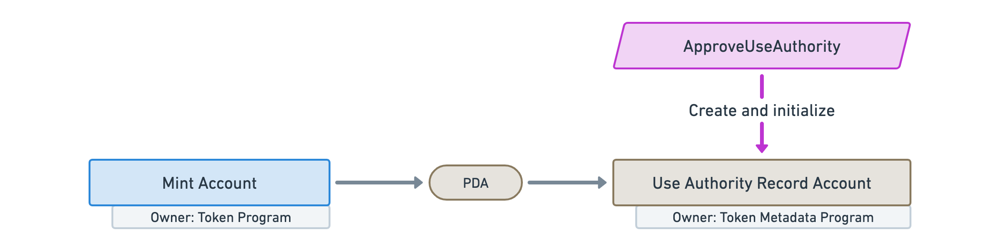

import ProgramInstruction from '../../../src/program-instruction.jsx';
import idl from './idl.js';

# Instructions

## Create a Metadata account

<ProgramInstruction idl={idl} instruction="CreateMetadataAccountV2">

TODO

</ProgramInstruction>

## Update a Metadata account

<ProgramInstruction idl={idl} instruction="UpdateMetadataAccountV2">

TODO

</ProgramInstruction>

## Indicate the primary sale has happened

<ProgramInstruction idl={idl} instruction="UpdatePrimarySaleHappenedViaToken">

TODO

</ProgramInstruction>

## Verify a creator

<ProgramInstruction idl={idl} instruction="SignMetadata">

TODO

</ProgramInstruction>

## Unverify a creator

<ProgramInstruction idl={idl} instruction="RemoveCreatorVerification">

TODO

</ProgramInstruction>

## Create a Master Edition account

<ProgramInstruction idl={idl} instruction="CreateMasterEditionV3">

TODO

</ProgramInstruction>

## Print a new Edition from a Master Edition

### Via owning the token

<ProgramInstruction idl={idl} instruction="MintNewEditionFromMasterEditionViaToken">

TODO

</ProgramInstruction>

### Via a Vault proxy

`MintNewEditionFromMasterEditionViaVaultProxy`

TODO

## Verify the collection

<ProgramInstruction idl={idl} instruction="VerifyCollection">

TODO

</ProgramInstruction>

## Unverify the collection

<ProgramInstruction idl={idl} instruction="UnverifyCollection">

TODO

</ProgramInstruction>

## Set and verify the collection

`SetAndVerifyCollection`

TODO

## Approve a new Collection Authority

<ProgramInstruction idl={idl} instruction="ApproveCollectionAuthority">

TODO

</ProgramInstruction>

## Revoke an existing Collection Authority

<ProgramInstruction idl={idl} instruction="RevokeCollectionAuthority">

TODO

</ProgramInstruction>

## Reduce the number of uses

<ProgramInstruction idl={idl} instruction="Utilize">

TODO

</ProgramInstruction>

## Approve a new Use Authority

<ProgramInstruction idl={idl} instruction="ApproveUseAuthority">

TODO

</ProgramInstruction>

## Revoke an existing Use Authority

<ProgramInstruction idl={idl} instruction="RevokeUseAuthority">

TODO

</ProgramInstruction>

## Freeze the token account as a delegate

<ProgramInstruction idl={idl} instruction="FreezeDelegatedAccount">

TODO: Freezes a token account that has been fully delegated.

</ProgramInstruction>

## Thaw the token account as a delegate

<ProgramInstruction idl={idl} instruction="ThawDelegatedAccount">

TODO: Thaws a token account that has been fully delegated.

</ProgramInstruction>

## Add padding to Metadata account fields

<ProgramInstruction idl={idl} instruction="PuffMetadata">

TODO

</ProgramInstruction>

## Upgrade Master Edition from V1 to V2

<ProgramInstruction idl={idl} instruction="ConvertMasterEditionV1ToV2">

TODO

</ProgramInstruction>
