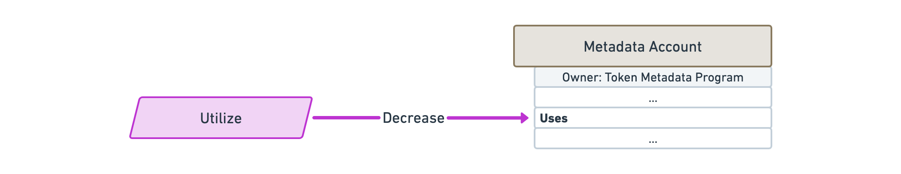

import ProgramInstruction from '../../../src/program-instruction.jsx';
import instructions from './instructions.js';

# Instructions

## Create a Metadata account

<ProgramInstruction instruction={instructions.CreateMetadataAccountV2}>

TODO

</ProgramInstruction>

## Update a Metadata account

<ProgramInstruction instruction={instructions.UpdateMetadataAccountV2}>

TODO

</ProgramInstruction>

## Indicate the primary sale has happened

<ProgramInstruction instruction={instructions.UpdatePrimarySaleHappenedViaToken}>

TODO

</ProgramInstruction>

## Verify a creator

<ProgramInstruction instruction={instructions.SignMetadata}>

TODO

</ProgramInstruction>

## Unverify a creator

<ProgramInstruction instruction={instructions.RemoveCreatorVerification}>

TODO

</ProgramInstruction>

## Create a Master Edition account

<ProgramInstruction instruction={instructions.CreateMasterEditionV3}>

TODO

</ProgramInstruction>

## Print a new Edition from a Master Edition

### Via owning the token

<ProgramInstruction instruction={instructions.MintNewEditionFromMasterEditionViaToken}>

TODO

</ProgramInstruction>

### Via a Vault proxy

`MintNewEditionFromMasterEditionViaVaultProxy`

TODO

## Verify the collection

<ProgramInstruction instruction={instructions.VerifyCollection}>

TODO

</ProgramInstruction>

## Unverify the collection

<ProgramInstruction instruction={instructions.UnverifyCollection}>

TODO

</ProgramInstruction>

## Set and verify the collection

`SetAndVerifyCollection`

TODO

## Approve a new Collection Authority

<ProgramInstruction instruction={instructions.ApproveCollectionAuthority}>

TODO

</ProgramInstruction>

## Revoke an existing Collection Authority

<ProgramInstruction instruction={instructions.RevokeCollectionAuthority}>

TODO

</ProgramInstruction>

## Reduce the number of uses

<ProgramInstruction instruction={instructions.Utilize}>

TODO

</ProgramInstruction>

## Approve a new Use Authority

<ProgramInstruction instruction={instructions.ApproveUseAuthority}>

TODO

</ProgramInstruction>

## Revoke an existing Use Authority

<ProgramInstruction instruction={instructions.RevokeUseAuthority}>

TODO

</ProgramInstruction>

## Freeze the token account as a delegate

<ProgramInstruction instruction={instructions.FreezeDelegatedAccount}>

TODO: Freezes a token account that has been fully delegated.

</ProgramInstruction>

## Thaw the token account as a delegate

<ProgramInstruction instruction={instructions.ThawDelegatedAccount}>

TODO: Thaws a token account that has been fully delegated.

</ProgramInstruction>

## Add padding to Metadata account fields

<ProgramInstruction instruction={instructions.PuffMetadata}>

TODO

</ProgramInstruction>

## Upgrade Master Edition from V1 to V2

<ProgramInstruction instruction={instructions.ConvertMasterEditionV1ToV2}>

TODO

</ProgramInstruction>
