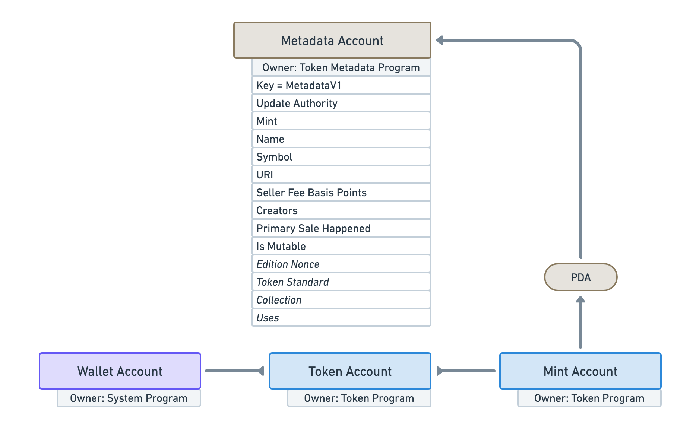
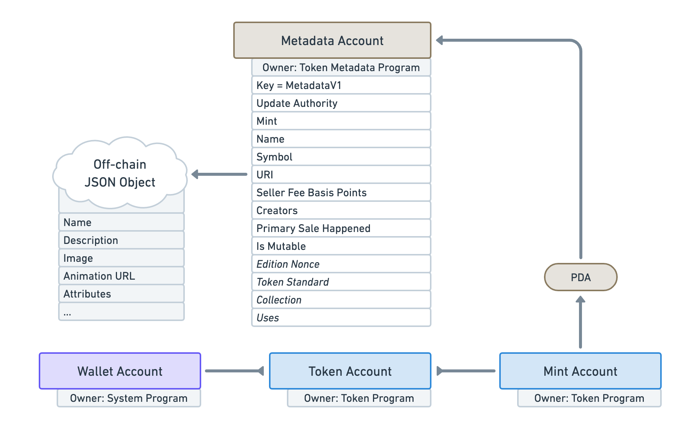
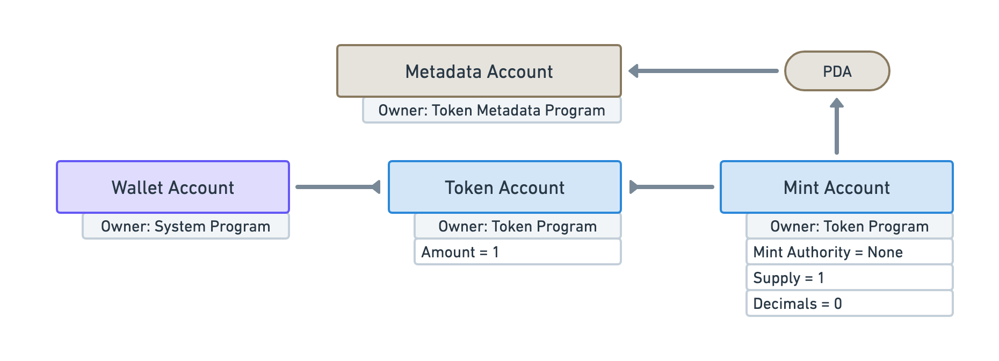
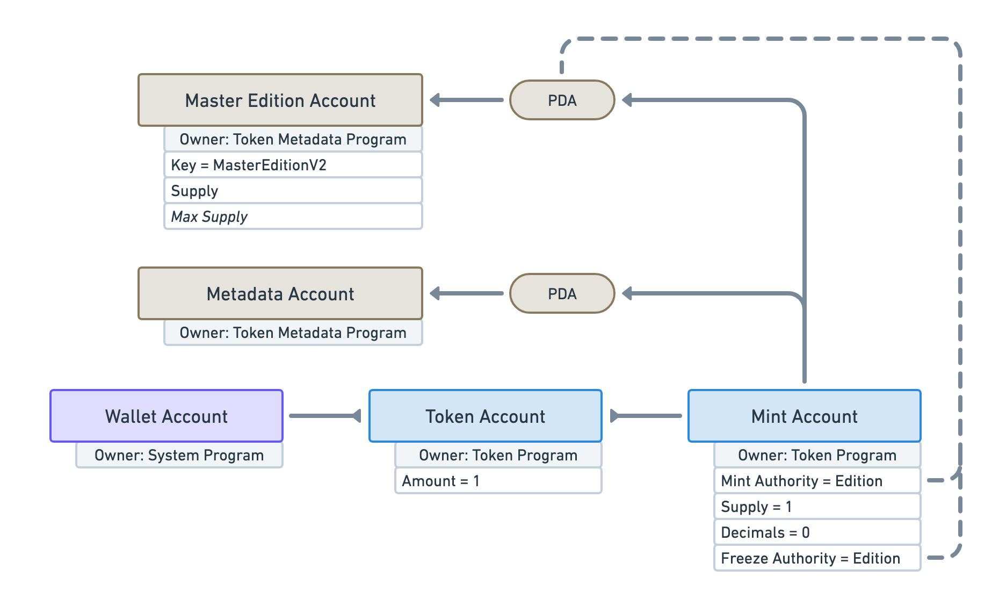
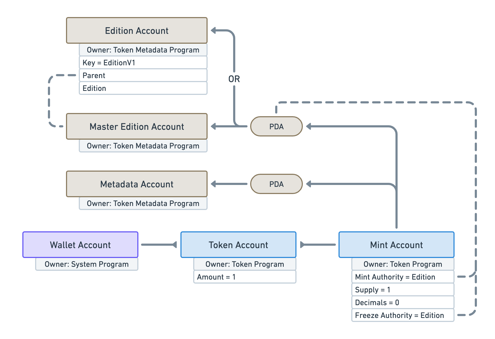
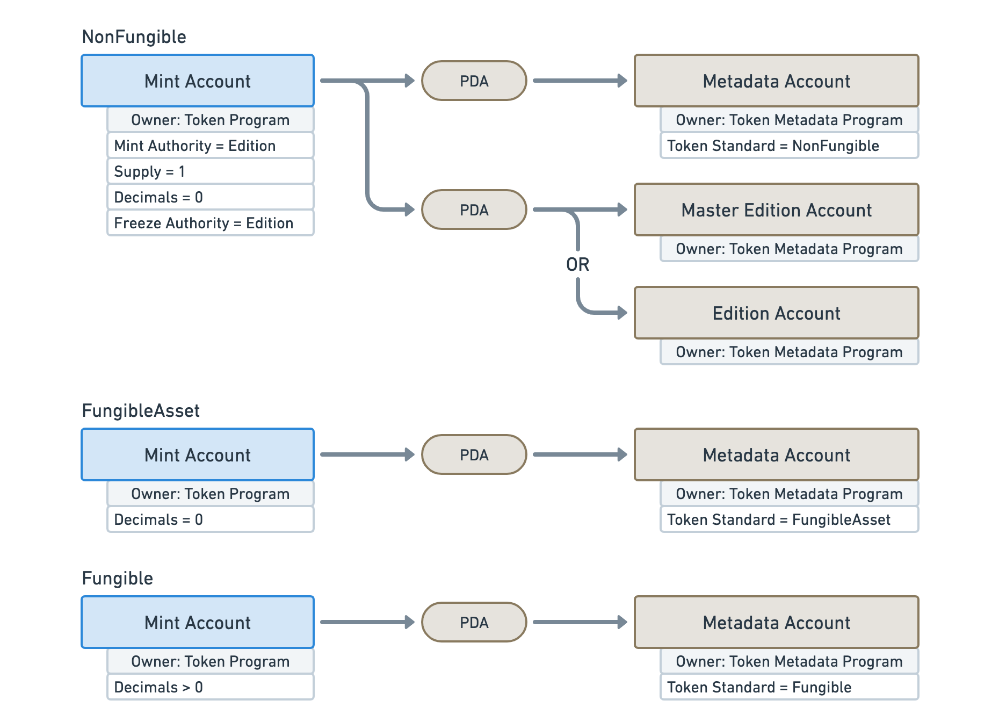

# Overview

## Introduction

The Token Metadata program is one of the most important program when dealing with NFTs on the Solana blockchain. Its main goal is to **attach additional data to Tokens** handled by [Solana’s Token program](https://spl.solana.com/token). You can think of a Token as a decentralised currency that lives in the Solana blockchain.

It achieves this using [Program Derived Addresses](https://docs.solana.com/developing/programming-model/calling-between-programs#program-derived-addresses) (PDAs) that are _derived_ from the address of Mint Accounts. If you’re not familiar with Solana’s Token program, _Mint Accounts_ are responsible for storing the global information of a Token and _Token Accounts_ store the relationship between a wallet and a Mint Account.

![A simple diagram showing a user icon followed by three blue rectangles in a straight line. From left to right, the rectangles are labeled: “Wallet Account”, “Token Account” and “Mint Account”. The user icon points to the “Wallet Account”, the “Wallet Account” points to the “Token Account” and the “Mint Account” points to the “Token Account”. Under the “Wallet Account” reads “Someone’s wallet”. Under the “Token Account” reads “Stores the amount of tokens owned by the wallet”. Under the “Mint Account” reads “Stores information about the token itself. E.g. its current supply and its authorities.”.](./assets/Token-Metadata-Overview-1.png)

Whilst Mint Accounts contain a few data attributes such as its current supply, it doesn’t offer the ability to inject standardized data that can be understood by apps and marketplaces.

This is why the Token Metadata program offers a **Metadata Account** that attaches itself to a Mint Account via a PDA.

That Metadata Account holds a lot valuable information that can be used throughout the ecosystem. For instance, it maintains a list of creators for the token. Each creator has a `Verified` attribute that, when `True`, guarantees the token was signed by that creator. Each creator also has a `Share` attribute that can be used by marketplaces to distribute royalties.

By attaching more data to the Mint Account, **the Token Metadata program is able to make Digital Assets** of regular on-chain Tokens.

## A JSON standard

One important attribute of the Metadata Account is the `URI` attribute that points to a JSON file off-chain. This is used to safely provide additional data whilst not being constraint by the fees involved in storing on-chain data. That JSON file [follows a certain standard](/programs/token-metadata/token-standard) that anyone can use to find useful information on tokens.

Note that, this JSON file can be stored using a permanent storage solution such as Arweave to ensure it cannot be updated. Additionally, one can use the `Is Mutable` attribute of the Metadata Account to make it immutable and, therefore, forbid the `URI` attribute to ever be changed. Using this combination, we can guarantee the immutability of the off-chain JSON file.

## NFTs

You might be wondering: what has this got to do with NFTs? Well, NFTs are special tokens that are [Non-Fungible](TODO).

More precisely, NFTs in Solana are Mint Accounts with the following characteristics:

- It has **a supply of 1**, meaning only one token is in circulation.
- It has **zero decimals**, meaning there cannot be such a thing as 0.5 tokens.
- It has **no mint authority**, meaning no one can ever mint additional tokens.

What we end up with is a token that cannot be traded with something of the same kind, which is the definition of a Non-Fungible Token (NFT).

In this particular yet popular case, the goal of the Metadata Account is to provide the actual data of that NFT in order to make it a useful Digital Asset.

Additionally, the Token Metadata program offers another account specifically for NFTs called the **Master Edition Account**. This accounts is also a PDA derived from the Mint Account.

Before creating this account, the Token Metadata program will ensure the special characteristics of Non-Fungible Tokens listed above are met. However, it is worth noting that, instead of voiding the Mint Authority, it will transfer both the Mint Authority and the Freeze Authority to the Master Edition PDA to ensure no one can mint or freeze tokens without going through the Token Metadata program. You can [read more about why this decision was made in the FAQ](/programs/token-metadata/faq#TODO).

Thus, **the existence of the Master Edition account acts as a proof of Non-Fungibility** for that Mint Account.

## Printing Editions

In addition to being a Non-Fungibility evidence, the Master Edition account also allows users to print one or multiple copies of an NFT.

This feature is particularly helpful to creators that want to offer multiple copies of their 1/1 NFTs to their audience.

The Master Edition account contains an optional `Max Supply` attribute that dictates the maximum amount of NFTs that can be printed that way. If set to `0`, printing is disabled. If set to `None` an unlimited amount of copies can be printed.

The Master Edition NFT, a.k.a. Original NFT, acts as the master record that one can use to print copies, a.k.a. Print NFTs.

Each Print NFT is made of its own Mint Account and its own Metadata Account whose data is copied from the Original NFT. However, instead of having a Master Edition account attached to their Mint Account, Print NFTs use yet another PDA account called an **Edition Account**. This account keeps track of the edition number and the parent Master Edition it originated from.

Note that the Master Edition account and the Edition account share the same seeds for their PDA. That means, an NFT can be one or the other but not both.

## Semi-Fungible Tokens

Whilst NFTs are the biggest use case of the Token Metadata program, it’s important to notice that the program also work with Fungible Token and, what we call, Semi-Fungible Tokens or Fungible Assets.

At the end of the day, the Metadata account helps attach data to tokens regardless of their fungibility. However, the standard of the off-chain JSON file will vary slightly to accommodate for their needs.

To safely identify the fungibility of a token — and, thus, the standard that we should use — the Metadata account keeps track of that information in its `Token Standard` attribute. This attribute is automatically computed by the program and cannot be manually updated. It can take the following values.

- `NonFungible`: The Mint account is associated with a Master Edition or Edition account and, therefore, is Non-Fungible. This is your typical NFT standard.
- `FungibleAsset`: The Mint account is Fungible but has zero decimal places. Having zero decimals means we can treat the token as an asset whose supply is not limited to one. For instance, Fungible Assets can be used in the gaming industry to store resources such as “Wood” or “Iron”.
- `Fungible`: The Mint account is Fungible and has more then one decimal places. This is more likely going to be a token used as a decentralised currency.

You can [read more about these standards here](/programs/token-metadata/token-standard).

## And a lot more

Whilst this provide a good overview of the Token Metadata program and what it has to offer, there’s still a lot more that can be done with it.

The other pages of the “Token Metadata” section aim to document it further and explain significant features in their own individual pages.

The next three pages focus on helping you get started with the Token Metadata program and provide detailed information on the accounts and instructions it provides so you get the full picture and can refer back to them in the future.

- [Getting started](/programs/token-metadata/getting-started)
- [Accounts](/programs/token-metadata/accounts)
- [Instructions](/programs/token-metadata/instructions)

The next pages act as in-depth guides on certain features offered by the program.

- [Token Standard](/programs/token-metadata/token-standard)
- [Printing Limited Editions](/programs/token-metadata/printing-editions)
- [Certified Collections](/programs/token-metadata/certified-collections)
- [Using NFTs](/programs/token-metadata/using-nfts)

Finally, the last two pages answers frequently asked questions and document version updates.

- [FAQ](/programs/token-metadata/faq)
- [Changelog](/programs/token-metadata/changelog)
