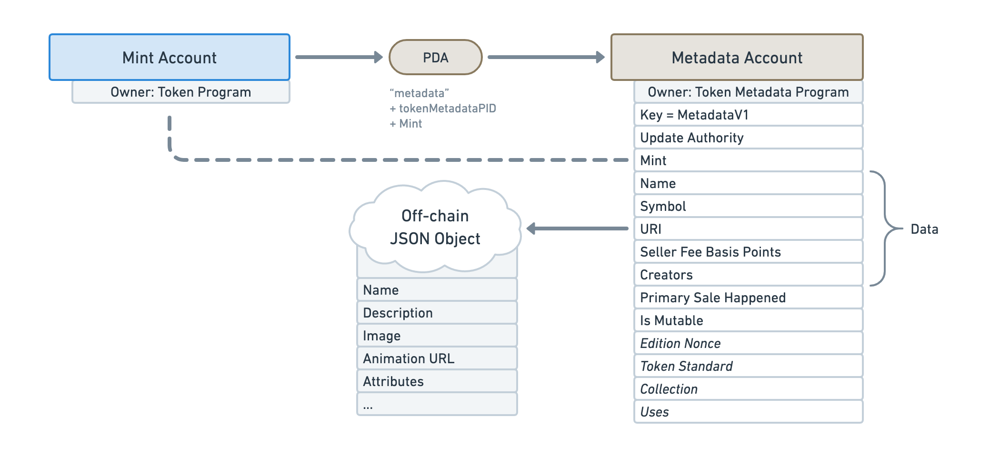

import ProgramAccount from '../../../src/program-account.jsx';

# Overview

The Token Metadata program is one of the most important program when dealing with NFTs on the Solana blockchain. Its main goal is to **attach additional data to Tokens** handled by [Solana’s Token program](https://spl.solana.com/token).

It achieves this using [Program Derived Addresses](https://docs.solana.com/developing/programming-model/calling-between-programs#program-derived-addresses) (PDAs) that are _derived_ from the address of Mint Accounts. If you’re not familiar with Solana’s Token program, _Mint Accounts_ are responsible for storing the information of a Token in Solana and _Token Accounts_ store the relationship between a wallet and a Mint Account.

![A simple diagram showing a user icon followed by three blue rectangles in a straight line. From left to right, the rectangles are labeled: “Wallet Account”, “Token Account” and “Mint Account”. The user icon points to the “Wallet Account”, the “Wallet Account” points to the “Token Account” and the “Mint Account” points to the “Token Account”. Under the “Wallet Account” reads “Someone’s wallet”. Under the “Token Account” reads “Stores the amount of tokens owned by the wallet”. Under the “Mint Account” reads “Stores information about the token itself. E.g. its current supply and its authorities.”.](./assets/Token-Metadata-Intro-1.png)

The account holding this extra data is called the **Metadata Account** and is derived from the Mint Account.

By attaching more data to the Mint Account, **the Token Metadata program is able to make Digital Assets** of regular on-chain Tokens.

For instance, say a Mint Account has the following properties:

- It has **a supply of 1**, meaning only one token is in circulation.
- It has **zero decimals**, meaning there cannot be such a thing as 0.5 tokens.
- It has **no mint authority**, meaning no one can ever mint additional tokens.

What we end up with is a token that cannot be traded with something of the same kind, which is the definition of a Non-Fungible Token (NFT). As such, the goal of the “Metadata Account” is to provide the actual data of that NFT in order to make it a useful Digital Asset.

Note that a Fungible Token can also benefit from the extra data provided by the “Metadata Account”. In this situation, the standard for that extra data will vary slightly.

There is a lot more that you can do with the Token Metadata program but this introduction provides a good overview of its main purpose. In the following pages, we will go through additional features offered by this program but first, let’s go through the accounts and instructions it provides.

## Accounts

### Metadata

<ProgramAccount>

The Metadata Account is responsible for storing the additional data attached to tokens. As every account in the Token Metadata program, it derives from the Mint Account using a PDA. Let’s take a look at all the different fields it contains.

</ProgramAccount>

The Metadata Account is responsible for storing the additional data attached to tokens. As every account in the Token Metadata program, it derives from the Mint Account using a PDA. Let’s take a look at all the different fields it contains.

| Field                       | Offset | Size | [Types](/programs/understanding-programs#types-of-field) | Description                                                                                                                                                                                                                                                                                                                                                                                                                                                                                                                                                                                                                                                                                                                                                                          |
| --------------------------- | ------ | ---- | -------------------------------------------------------- | ------------------------------------------------------------------------------------------------------------------------------------------------------------------------------------------------------------------------------------------------------------------------------------------------------------------------------------------------------------------------------------------------------------------------------------------------------------------------------------------------------------------------------------------------------------------------------------------------------------------------------------------------------------------------------------------------------------------------------------------------------------------------------------ |
| **Key**                     | 0      | 1    |                                                          | The discriminator of the account. The Token Metadata program uses an enum to differentiate the accounts it provides.                                                                                                                                                                                                                                                                                                                                                                                                                                                                                                                                                                                                                                                                 |
| **Update Authority**        | 1      | 32   |                                                          | The public key that is allowed to update this account.                                                                                                                                                                                                                                                                                                                                                                                                                                                                                                                                                                                                                                                                                                                               |
| **Mint**                    | 33     | 32   |                                                          | The public key of the Mint Account it derives from.                                                                                                                                                                                                                                                                                                                                                                                                                                                                                                                                                                                                                                                                                                                                  |
| **Name**                    | 65     | 36   |                                                          | The on-chain name of the token, limited to 32 bytes. For instance “Degen Ape #1 ”.                                                                                                                                                                                                                                                                                                                                                                                                                                                                                                                                                                                                                                                                                                   |
| **Symbol**                  | 101    | 14   |                                                          | The on-chain symbol of the token, limited to 10 bytes. For instance “DAPE”.                                                                                                                                                                                                                                                                                                                                                                                                                                                                                                                                                                                                                                                                                                          |
| **URI**                     | 115    | 204  |                                                          | The URI of the token, limited to 200 bytes. **This URI points to an off-chain JSON file that contains additional data following a certain standard.** You can [learn more about this JSON standard here](TODO). The JSON file can either be stored in a traditional server (e.g. using AWS) or using a permanent storage solution such as using Arweave.                                                                                                                                                                                                                                                                                                                                                                                                                             |
| **Seller Fee Basis Points** | 319    | 2    | Indicative                                               | The royalties shared by the creators in basis points — i.e. `550` means `5.5%`. Whilst this field is used by virtually all NFT marketplaces, it is not enforced by the Token Metadata program itself.                                                                                                                                                                                                                                                                                                                                                                                                                                                                                                                                                                                |
| **Creators**                | 321    | ~    |                                                          | An array of creators and their share of the royalties. This array is limited to 5 creators. Each creator contains the following fields: - `Address`: The public key of the creator (32 bytes). - `Verified`: A boolean indicating if the creator signed the NFT (1 byte). It is important to check this field to ensure the authenticity of the creator. - `Share`: (Indicative) The creator’s shares of the royalties in percentage (1 byte) — i.e. `55` means `55%`. Similarly to the `Seller Fee Basis Points` field, this is used by marketplaces but not enforced by the Token Metadata program. Note that, because the `Creators` field is an array of variable length, we cannot guarantee the byte position of any field that follows (Notice the tilde `~` in the diagram). |
| **Primary Sale Happened**   | ~      | 1    |                                                          | (Indicative) A boolean indicating if the token has already been sold at least once. Once flipped to `True`, it cannot ever be `False` again. This field can affect the way royalties are distributed.                                                                                                                                                                                                                                                                                                                                                                                                                                                                                                                                                                                |
| **Is Mutable**              | ~      | 1    |                                                          | A boolean indicating if the Metadata Account can be updated. Once flipped to `False`, it cannot ever be `True` again.                                                                                                                                                                                                                                                                                                                                                                                                                                                                                                                                                                                                                                                                |
| **Edition Nonce**           | ~      | 2    |                                                          | (Optional) A nonce used to verify the edition number of printed NFTs. It will only be set on Edition NFTs and not Master Edition NFTs.                                                                                                                                                                                                                                                                                                                                                                                                                                                                                                                                                                                                                                               |
| **Token Standard**          | ~      | 2    |                                                          | (Optional) This enum captures the fungibility of the token. You can [learn more about the token standard here](TODO).                                                                                                                                                                                                                                                                                                                                                                                                                                                                                                                                                                                                                                                                |
| **Collection**              | ~      | 34   |                                                          | (Optional) This field optionally links to the Mint address of another NFT that acts as a Collection NFT. It contains the following sub-fields: - `Key`: The public key of the Collection NFT’s Mint Account (32 bytes). - `Verified`: A boolean indicating if the owner of the Collection NFT signed this NFT (1 byte). It is important to check this field to ensure the authenticity of the collection. You can [learn more about NFT Collection here](TODO).                                                                                                                                                                                                                                                                                                                      |
| **Uses**                    | ~      | 18   |                                                          | (Optional) This field can make NFTs usable. Meaning you can load it with a certain amount of “uses” and use it until it has run out. You can [learn more about using NFTs here](TODO).                                                                                                                                                                                                                                                                                                                                                                                                                                                                                                                                                                                               |

### Master Edition

<!--  -->

TODO

### Edition

<!--  -->

TODO

### Edition Marker

<!--  -->

TODO

### Collection Authority Record

<!--  -->

TODO

### Use Authority Record

<!--  -->

TODO

## Instructions

### CreateMetadataAccountV2

<!--  -->

TODO

### UpdateMetadataAccountV2

<!--  -->

TODO

### UpdatePrimarySaleHappenedViaToken

<!--  -->

TODO

### SignMetadata and RemoveCreatorVerification

<!-- verify%20Creators@2x.png>) -->

TODO

### CreateMasterEditionV3

<!--  -->

TODO

### MintNewEditionFromMasterEditionViaToken

<!--  -->

TODO

### VerifyCollection and UnverifyCollection

<!-- verify%20Collection@2x.png>) -->

TODO

### ApproveCollectionAuthority

<!--  -->

TODO

### RevokeCollectionAuthority

<!--  -->

TODO

### Utilize

<!--  -->

TODO

### ApproveUseAuthority

<!--  -->

TODO

### RevokeUseAuthority

<!--  -->

TODO

### Others

- MintNewEditionFromMasterEditionViaVaultProxy
- SetAndVerifyCollection
- ConvertMasterEditionV1ToV2
- PuffMetadata
- FreezeDelegatedAccount: Freezes a token account that has been fully delegated.
- ThawDelegatedAccount: Thaws a token account that has been fully delegated.

TODO

## Examples

TODO NFT / SFT Mention article here.
