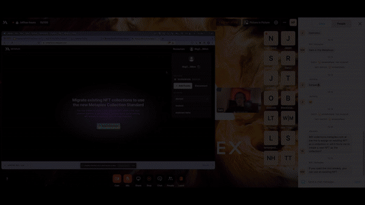

# Specification
The Token Metadata program provides decorator structs to a token mint. Basic information about the token is provided with the `Metadata` struct, whose account address is a Program Derived Address (PDA) with a derived key of `['metadata', metadata_program_id, mint_id]`.
Your NFT should have the following information as on-chain metadata:

## Full Metadata Struct
The below code snippet is the representation on chain of the full metadata struct.

```rust
pub struct Metadata {
    pub key: Key,
    pub update_authority: Pubkey,
    pub mint: Pubkey,
    pub data: Data,
    // Immutable, once flipped, all sales of this metadata are considered secondary.
    pub primary_sale_happened: bool,
    // Whether or not the data struct is mutable, default is not
    pub is_mutable: bool,
    /// nonce for easy calculation of editions, if present
    pub edition_nonce: Option<u8>,
    /// Token Standard is deterministic and will change from SemiFungible to NonFungible if
    /// you call the create master edition call and it succeeds.
    pub token_standard: Option<TokenStandard>,
    /// Since we cannot easily change Metadata, we add the new DataV2 fields here at the end.
    /// Collection
    pub collection: Option<Collection>,
    /// Uses
    pub uses: Option<Uses>,   
}
```

The URI filed contains a pointer to the rest of the metadata. This metadata is stored off chain in most cases and the URI is usually a `https:` link to some decentralized storage.
This uri must point to a JSON file that conforms to one of our Token Standards.

:::info

NOTE: The below Token Standards were introduced in Token Metadata v1.1.0.
Many tokens will still conform to the v1.0.0 `NonFungible` json standard [V1.0.0](/token-metadata/Versions/v1.0.0/nft-standard)

:::

## **Token Standards**

As token usage has evolved on Solana, it has become clear that there are more types of tokens than simply "fungible" and "non-fungible" tokens. An example is something the community is calling a "semi-fungible token", a SPL token with a supply greater than 1 but which has typical NFT attributes such as an image and an attributes array in the JSON metadata. The consensus seems to be that these should be stored in wallets in the same view as standard NFTs, or in their own view but separate from "standard" fungible SPL tokens. These tokens are becoming popular in gaming contexts to support fungible items such as a kind of sword or a piece of wood, etc. but which are in a different league from typical fungible SPL tokens such as USDC.

In order to support this particular use-case but also to make the standard broad enough to allow expansion to other token types in the future, we are adding a `token_standard` field to the `Metadata` struct which will map to particular JSON metadata standards and will be used to objectively differentiate token types.

This solves a current pain-point for third parties such as wallets which are applying inconsistent and varying heuristics to determine what is and is not an "NFT".

Token Standards are defined by a Rust enum:

```rust
pub enum TokenStandard {
    NonFungible,   // This is a master edition
    FungibleAsset, // A token with metadata that can also have attributes, sometimes called Semi Fungible
    Fungible,      // A token with simple metadata
    NonFungibleEdition, // This is a limited edition
}
```

A `token_standard` field is added to the `Metadata` struct representing what type of token each NFT is.

The `token_standard` field is set automatically by the contract corresponding to the following logic:

If the token has a master edition it is a `NonFungible`.
If the token has no master edition(ensuring its supply can be > 1) and decimals of 0 it is a `FungibleAsset`.
If the token has no master edition(ensuring its supply can be > 1) and decimals of > 0 it is a `Fungible`.
If the token is a limited edition of a MasterEditon it is a `NonFungibleEdition`.

Each Token Standard type will have its own JSON schema which are defined below.

**Fungible**

These are simple SPL tokens with limited metadata and supply >= 0. Examples are USDC, GBTC and RAY.

| Field       | Type   | Description                 |
| ----------- | ------ | --------------------------- |
| name        | string | Name of the token.          |
| symbol      | string | Symbol of the token.        |
| description | string | Description of the token.   |
| image       | string | URI pointing to token logo. |

Example Fungible token JSON metadata:

```json
{
  "name": "USD Coin",
  "symbol": "USDC",
  "description": "Fully reserved fiat-backed stablecoin created by Circle.",
  "image": "https://www.circle.com/hs-fs/hubfs/sundaes/USDC.png?width=540&height=540&name=USDC.png"
}
```

**Fungible Asset**

These are fungible tokens with more extensive metadata and supply >= 0. An example of this kind of token is something the community has been calling "semi-fungible tokens" often used to represent a fungible but attribute-heavy in-game item such as a sword or a piece of wood.

| Field         | Type   | Description                                                                    |
| ------------- | ------ | ------------------------------------------------------------------------------ |
| name          | string | Name of the asset.                                                             |
| symbol        | string | Symbol of the asset.                                                           |
| description   | string | Description of the asset.                                                      |
| image         | string | URI pointing to asset image.                                                   |
| animation_url | string | URI pointing to asset animation.                                               |
| external_url  | string | URI pointing to an external url defining the asset, the game's main site, etc. |
| attributes    | array  | Array of attributes defining the characteristics of the asset.                 |
|               |        |                                                                                |

**Attribute**

| Field      | Type   | Description            |
| ---------- | ------ | ---------------------- |
| trait_type | string | The type of attribute. |
| value      | string | The attribute value.   |

Example Fungible Asset JSON metadata:

```json
{
  "name": "SolanaGame Steel Sword",
  "symbol": "SG-SS-1",
  "description": "SolanaGame steel sword available after Level 4",
  "image": "<https://arweave.net/26YdhY_eAzv26YdhY1uu9uiA3nmDZYwP8MwZAultcE?ext=jpeg>",
  "animation_url": "<https://arweave.net/ZAultcE_eAzv26YdhY1uu9uiA3nmDZYwP8MwuiA3nm?ext=glb>",
  "external_url": "<https://SolanaGame.io>",
  "attributes": [
    {
      "trait_type": "attack",
      "value": "4"
    },
    {
      "trait_type": "defense",
      "value": "3"
    },
    {
      "trait_type": "durability",
      "value": "47"
    },
    {
      "trait_type": "components",
      "value": "iron: 10; carbon: 1; wood: 2"
    }
  ]
}
```

**Non-Fungible Token / Fungible Edition**

These are the "standard" non-fungible tokens the community is already familiar with and have both a Metadata PDA and a Master Edition PDA. Examples of these are Solana Monkey Business, Stylish Studs and Thugbirdz.

| Field         | Type   | Description                                                                    |
| ------------- | ------ | ------------------------------------------------------------------------------ |
| name          | string | Name of the asset.                                                             |
| symbol        | string | Symbol of the asset.                                                           |
| description   | string | Description of the asset.                                                      |
| image         | string | URI pointing to asset image.                                                   |
| animation_url | string | URI pointing to asset animation.                                               |
| external_url  | string | URI pointing to an external url defining the asset, the game's main site, etc. |
| attributes    | array  | Array of attributes defining the characteristics of the asset.                 |

**Attribute**

| Field      | Type   | Description            |
| ---------- | ------ | ---------------------- |
| trait_type | string | The type of attribute. |
| value      | string | The attribute value.   |

Example Non-Fungible Token JSON metadata:
Note: Creators, Symbol

```json
{
  "name": "SolanaArtProject #1",
  "description": "Generative art on Solana.",
  "image": "https://arweave.net/26YdhY_eAzv26YdhY1uu9uiA3nmDZYwP8MwZAultcE?ext=jpeg",
  "animation_url": "https://arweave.net/ZAultcE_eAzv26YdhY1uu9uiA3nmDZYwP8MwuiA3nm?ext=glb",
  "external_url": "https://example.com",
  "attributes": [
    {
      "trait_type": "trait1",
      "value": "value1"
    },
    {
      "trait_type": "trait2",
      "value": "value2"
    }
  ],
  //@deprecated -> do not use - may be removed in a future release
  "collection": {
    "name": "Solflare X NFT",
    "family": "Solflare"
  },
  "properties": {
    "files": [
      {
        "uri": "https://www.arweave.net/abcd5678?ext=png",
        "type": "image/png"
      },
      {
        "uri": "https://watch.videodelivery.net/9876jkl",
        "type": "unknown",
        "cdn": true
      },
      {
        "uri": "https://www.arweave.net/efgh1234?ext=mp4",
        "type": "video/mp4"
      }
    ],
    "category": "video",
    //@deprecated -> do not use - may be removed in a future release
    "creators": [
      {
        "address": "xEtQ9Fpv62qdc1GYfpNReMasVTe9YW5bHJwfVKqo72u",
        "share": 100
      }
    ]
  }
}
```


## **Collections**

Introduced in v1.1.0 of the token metadata standard, _on-chain collections_
replace the `collection` field previously defined in external JSON metadata.
Gone are the ad-hoc community heuristics for determining a collection,
superseded with an objective, easy-to-use on-chain implementation.

### **On-Chain Representation of a Collection**

:::info

A `collection` is an NFT. It has the same data layout on-chain as any other NFT.

:::

An NFT is linked to a collection in a belongs_to style where the NFT has a
reference back to the collection. This is implemented through the addition of
a new `collection` field in the `Metadata` struct.

```rust
pub struct Metadata {
    pub key: Key,
    pub update_authority: Pubkey,
    pub mint: Pubkey,
    pub data: Data,
    // Immutable, once flipped, all sales of this metadata are considered secondary.
    pub primary_sale_happened: bool,
    // Whether or not the data struct is mutable, default is not
    pub is_mutable: bool,
    /// nonce for easy calculation of editions, if present
    pub edition_nonce: Option<u8>,
    /// Token Standard is deterministic and will change from SemiFungible to NonFungible if
    /// you call the create master edition call and it succeeds.
    pub token_standard: Option<TokenStandard>,
    /// Since we cannot easily change Metadata, we add the new DataV2 fields here at the end.
    /// Collection
    pub collection: Option<Collection>,
    ...
}

#[derive(BorshSerialize, BorshDeserialize, PartialEq, Debug, Clone)]
pub struct Collection {
  pub verified: bool, // Whether or not the collection is verified
  pub key: Pubkey,    // The SPL token mint account of the collection NFT
}
```

The metadata `collection` field maps to the Mint Address of the collection NFT and is
represented as the Rust type `Option<Collection>` where a value of `None` is
interpreted to mean the NFT does not belong to any collection. The `Collection`
struct has the fields `verified` denoting whether or not the collection is
verified (see below) and `key` which points to the `mint` account of the collection NFT.

#### Collection struct fields

| Field    | Type   | Description                                |
| -------- | ------ | ------------------------------------------ |
| verified | bool   | Whether the collection is verified or not. |
| key      | Pubkey | The SPL token mint account                 |

### Verifying A Collection

:::warning

EXTREMELY IMPORTANT:

Explorers, Wallets and Marketplaces, MUST CHECK IF `verified` is true. Verified can only be set true if the Authority on the Collection NFT has run the `verify_collection` instruction over the NFT.

This is the exact same pattern as the `Creators` field where `verified` must be true in order to validate the NFT.

In Order to check if a collection is valid on an NFT you MUST
1. Check that the Collection struct is set
2. That the pubkey in the collection struct is owned on chain by the spl-token program
3. That verified is true

If those 3 steps are not followed you could be exposing fradulent NFTs on real collections

:::

This implementation has the following advantages:

- Easy to identify which collection any given NFT belongs to without making additional on-chain calls
- Possible to find all NFTs that belong to a given collection by making a `getProgramAccounts` call
- Uses existing padding at the end of `Metadata` so adds no on-chain rent storage costs

### Delegate Collection Authority Record

Update Authorities on a Collection NFT can delegate the authority to call the
`verify_collection` instruction. This allows you to delegate the ability to add
NFTs to your collection to many parties. You can do this by calling the
`approve_collection_authority` instruction. To revoke you can call the
`revoke_collection_authority` instruction.

To accomplish setting and verifying a collection with one instruction use the `set_and_verify_collection` instruction introduced in 1.2.0.

## Token Use Settings

To support gaming applications, the concept of "token usage" has been implemented, where a new `uses` field has been added to the `Metadata` struct. This field is a Rust `Option<Uses>` where `Uses` is a Rust struct with a `UseMethod` enum:

```rust
pub struct Uses {
    pub use_method: UseMethod,
    pub remaining: u64,
    pub available: u64,
}

pub enum UseMethod {
    Burn,
    Single,
    Multiple(u64)
}
```

This allows projects to set different limits on usage of gaming tokens: burn, single, and multiple use. Burn allows a token to be used once and then burned forever. Single allows a single use but does not burn the token. Multiple allows up to `u64` number of uses of the token.

### Delegate Use Authority

Owners of NFTs can now allow a program to `Use` their token without them being online. This is available via the `approve_use_authority` instruction. It is very similar to the Collection Authority system but the party who can approve and revoke is the current holder of the NFT.


### Verify a collection using collections.metaplex.com

1. Visit collections.metaplex.com[https://collections.metaplex.com/]
2. Connect your wallet, but first verify this wallet is the upgrade authority. 
3. Select the cluster you want to work on devnet, mainnet, etc. 
4. Click on create "Create a Collection" 
5. Put in the name, symbol, logo, and description of your nft collection.
6. Choosing between the three options: 
   1. "Individual NFTs" -> insert the mint address of your NFT
   2. "First verified creator" -> locate the candy machine address and insert this
   3. "CSV file" -> upload a csv file that contains the list of mint addresses
7. Then click "Create Collection" and two transactions approvals will be required. The first transaction approval will allow Metaplex to be the delegate to make the migration. The second transaction will be the crete the Parent NFT
8. After the Parent NFT is created the migration will start to begin. You can then close the tab and come back to it later with the same wallet to see the status. 

:::warning

   Always check Solana's Network before you start up a migration. You can check here https://solscan.io/

   If a "Retry" button appears it could be due to a network congestion, so click retry and monitor the network. 

   If a "Fail to Migrate Collection" appears this is typically due to the wrong Upgrade Authority. 

   All other issues please visit our discord for further support.

:::




[Full Verified Collections Tutorial](https://drive.google.com/file/d/1VU4xL_yF6LCe0UogVn4As5PMAzUV__8C/view?usp=sharing)
